# JS-Web-Game

## Chapter 10. Text RPG

## 000. FlowChart


## 001. Rules

1. General Mode : go Shop, go Adventure, Time to rest, End game
2. Adventure Mode : Attack, Heal, Defense, Run
3. Victory: gain experience point(exp || xp) -> Lv up -> Attack, HP, DEF up
4. Defeat: game over

## 002. HTML 구성하기

<form>을 활용해서, <input>, <button>를 작성하고, 각각 id, class를 활용해 작성해야 한다.

각각 시작 화면('#start\_\_screen'), 캐릭터 정보 화면('#hero\_\_stat'), 일반 모드 화면('#game\_\_menu'), 전투 모드 화면('#battle\_\_menu'), 몬스터 정보 화면('#monster\_\_stat') 총 5가지 화면으로 구성된다.

## 003. HTML 화면 전환하기

style 속성을 조작해 화면을 전환할 수 있다.
`style.display = 'none'`을 통해 시작 화면을 숨기고, 일반 모드 화면을 `style.display = 'block'`을 통해 보이게 만들 수 있다.

## 004. 등장인물의 정보 입력하기

객체를 활용해서 캐릭터와 몬스터의 stats을 설정한다.

```js
const heroInitialStats = [
  {
    name: "",
    job: "warrior",
    lv: 1,
    maxHp: 100,
    hp: 100,
    exp: 0,
    atk: 10,
    def: 20,
    item: "",
  },
  {
    name: "",
    job: "archer",
    lv: 1,
    maxHp: 80,
    hp: 80,
    exp: 0,
    atk: 20,
    def: 10,
    item: "",
  },
  {
    name: "",
    job: "assassin",
    lv: 1,
    maxHp: 70,
    hp: 70,
    exp: 0,
    atk: 30,
    def: 5,
    item: "",
  },
];

const monsterList = [
  { name: "slime", hp: 25, atk: 10, exp: 10, def: 0 },
  { name: "ghost", hp: 20, atk: 10, exp: 20, def: 30 },
  { name: "skeleton", hp: 45, atk: 15, exp: 20, def: 20 },
  { name: "onePig", hp: 50, atk: 30, exp: 30, def: 15 },
];
```

## 005. <form> 내부의 input 값 가져오기

<form> 내부의 <input>의 값을 가져오기 위해서는, dot notation이 아니라, `[]`와 id 값을 활용해 접근해야 한다.

```js
const name = event.target["start__input"].value;
```

## 006. JSON.stringfy, JSON.parse

parse method는 문자열을 객체로, stringfy method는 객체를 문자열로 변경하는 method이다. 다만, 두 method를 조합하여 사용하면 대상 객체를 깊은 복사(Deep Copy)할 수 있다.

```js
const monster1 = JSON.parse(JSON.stringfy(monsterList[0])); // 깊은 복사
const monster2 = monsterList[0];  // 참조
const monster3 = { ...monster[0] }; // 얕은 복사(객체 리터럴)

monster1.name = '이름 변경하기1';
monster2.name = '이름 변경하기2';

monsterList[0] === monster1;
monsterList[0] === monster2;

< false
< true
```

깊은 복사를 한 경우에는 원래 객체와 서로 다른 객체가 되어 깊은 복사를 한 `monster1`을 수정해도 원래 객체인 `monsterList`에 아무런 영향이 가지 않는다. 이와 달리 단순히 참조한 경우에는 `monster2`를 수정하면 두 객체가 연결되어 있기 때문에 원래 객체인 `monsterList`도 수정된다.

깊은 복사는 객체의 내/외부가 모두 참조 관계가 모두 끊기고 다른 객체로 복사하는 반면에, 얕은 복사(Shallow Copy)를 한 객체는 가장 바깥의 객체는 참조 관계가 끊겨 새로운 객체로 복사되는데, 내부의 객체는 참조 관계가 유지된다. 이러한 얕은 복사는 `spread` 문법을 활용해 할 수 있다.(배열의 경우, `slice` method로 얕은 복사를 할 수 있다.)

```js
const a = [];
const b = "hello";
const c = {};
const arr = [a, b, c];

const arr1 = arr; // 참조
const arr2 = JSON.parse(JSON.stringfy(arr)); // 깊은 복사
const arr3 = [...arr]; // 얕은 복사

arr1[1] = "hi";
arr2[1] = "hi";
arr3[1] = "hi";

arr === arr1; // true
arr === arr2; // false
arr === arr3; // false
```

즉, 단순히 얕은 복사한 배열의 요소를 변경하는 것은 깊은 복사와 마찬가지로 다른 객체/배열이 되어 2번째 요소가 변경되고, 기존 배열과 같지 않다.

```js
arr1[0].push(1);
arr2[0].push(1);
arr3[0].push(1);

arr === arr1; // true
arr === arr2; // true
arr === arr3; // false
```

다만, 첫 번째 요소인 빈 배열에 새로운 요소를 추가하는 경우에는, 얕은 복사를 하면 내부의 참조 관계가 유지되기 때문에, 해당 배열이 기존 배열에서도 변경된다.

즉, 얕은 복사를 하면, 객체가 아닌 원시값(string, number, boolean, `null`, `undefined`)은 복사가 되고, 배열이나 객체 리터럴 등의 객체는 참조가 된다. 원시값은 다른 변수에 할당하면, 복사가 되기 때문이다.

따라서 객체 내부의 객체까지 복사하기 위해서는 깊은 복사를 활용해야 한다.

참고)

1. 원시값(string, number, boolean, `null`, `undefined`)은 단순히 다른 변수에 할당하는 것만으로도 복사가 되고, 복사된 값을 변경해도 원본이 변경되지 않는다.

2. 내부에 객체가 들어있지 않은 배열은 `slice`, `concat` method를 통해 복사할 수 있고, 내부에 객체가 들어있지 않은 객체 리터럴은 `...` 연산자를 활용해 `spread` 문법으로 복사할 수 있다.

3. 내부에 객체가 들어있는 객체는 깊은 복사를 활용해 내부 객체도 복사해야 한다.

4. 간단한 객체는 `JSON.parse(JSON.stringfy(object))`로 깊은 복사를 할 수 있지만, 성능도 느리고 함수, `Math`, `Date` 등의 객체를 복사할 수 없기 때문에 실무에서는 `lodash clone`과 같은 라이브러리를 활용한다.

## 007. 객체 내부에 method 구현하기

기본적으로 `this`는 브라우저에서의 `window`를 가리킨다.

하지만, 객체 내부에 method를 구현할 때, 자기 자신을 가리키기 위해 `this`를 활용한다. 객체 내부에서만 `this`가 객체 자기 자신을 가리키기 때문이다. 활용할 때에도 `objectName.method()`를 통해 해당 method를 사용할 수 있는데 이때에만 `this`가 자기 자신(`objectName`)을 의미한다.

이러한 객체의 method를 구현할 때, 화살표 함수를 사용하면, `this`가 본래 의미 그대로 `window`를 가리키기 때문에 제대로 작동하지 않기 때문에 사용하면 안 된다.

객체 리터럴 내부에서 `function` method를 구현하는 경우 `function` 예약어와 `:`를 생략할 수 있다.

```js
const add = {
  result: 0;
  a: 1,
  b: 2,
  c: 3,
  add: function(number) {
    result += (number + a + b + c);
  };
}
```

```js
const add = {
  result: 0;
  a: 1,
  b: 2,
  c: 3,
  add(number) {
    result += (number + a + b + c);
  };
}
```

## 008. 전투 모드 구현하기 / 클래스 문법

```js
heroInitialStats.attack(monster);
monster.attack(heroInitialStats);
```

이처럼 user의 캐릭터와 임의로 생성된 몬스터 사이의 `attack`과 `defense`, `heal` method를 각각 구현하면 이후 추가적인 캐릭터와 몬스터의 등장에 있어서 지속적으로 method를 생성해야 하기 때문에, 코드의 간결성을 해치게 된다. 따라서 객체와 객체의 상호작용이 많은 경우에는 클래스 문법을 활용해야 한다.

이처럼 지속적으로 유사한 특성의 객체(`monster`, `hero`)를 만들어야 하거나, 상호작용(`attack`, `defense`)이 빈번하게 일어나는 경우에는 클래스 문법을 활용해 간결하고 효율적인 코드를 작성할 수 있다.

클래스 이전에는 함수(Factory function)를 활용해 객체를 만들 수 있었다.

```js
function createMonster(name, hp, exp, atk, def) {
  return {
    name,
    hp,
    exp,
    atk,
    def,
    attack(monster) {
      monster.hp -= this.atk;
      this.hp -= monster.atk;
    },
    heal(monster) {
      this.hp += 20;
      this.hp -= monster.atk;
    },
  };
}
const monster1 = createMonster("slime", 25, 10, 10, 5);
const monster2 = createMonster("slime", 45, 20, 10, 5);
const monster3 = createMonster("slime", 50, 15, 30, 10);
```

다만, 객체를 생성할 때 서로 참조 관계가 아니라 다른 객체여야 한다는 점이 중요하다. 같은 객체를 참조하여 반환하면, 하나를 수정할 때 다른 객체도 모두 수정되기 때문에 위 함수(Factory function)은 매번 새로운 객체를 반환할 수 있도록 객체 리터럴로 return 값을 만들었다.

나아가 `this`와 생성자 함수를 활용해 객체를 만들 수도 있다.

```js
function Monster(name, hp, exp, atk, def) {
  this.name = name;
  this.hp = hp;
  this.exp = exp;
  this.atk = atk;
  this.def = def;
}

Monster.prototype.attack = function (monster) {
  monster.hp -= this.atk;
  this.hp -= monster.atk;
};

Monster.prototype.heal = function (monster) {
  this.hp += 20;
  this.hp -= monster.atk;
};

const monster1 = new Monster("slime", 25, 10, 10, 5);
const monster2 = new Monster("slime", 45, 20, 10, 5);
const monster2 = new Monster("slime", 50, 15, 30, 10);
```

생성자 함수 앞에 `new` 키워드를 사용하면, `this`가 `window`가 아니라, 가상의 새로운 객체를 가리키게 되고, 해당 생성자 함수의 `return` 값이 해당 새로운 객체의 속성 값을 수정하여 객체가 된다. 따라서 생성자 함수를 활용하기 위해서는 `new`가 필수적이다.(`new`를 붙이지 않고 생성자 함수를 호출하면, `this`가 `window`가 되어 `window.name`이 변경되기 때문에 반드시 `new`를 붙여야 한다.)

첫 글자로 대문자를 사용하는 것이 반드시 지켜야할 규칙은 아니지만, `new Set();`, `new Date();` 와 같이 대문자를 사용하는 것이 암묵적인 약속이다.

이후 생성자 함수를 더 편하게 사용할 수 있도록 클래스 문법을 도입되었다.

```js
class Monster {
  constructor(name, hp, exp, atk, def) {
    this.name = name;
    this.hp = hp;
    this.exp = exp;
    this.atk = atk;
    this.def = def;
  }
}

const monster1 = new Monster("slime", 25, 10, 10, 5);
const monster2 = new Monster("slime", 45, 20, 10, 5);
const monster3 = new Monster("slime", 50, 15, 30, 10);
```

`class` 예약어로 클래스를 선언하고, `constructor` method 내부에 기존 코드를 작성하면 된다. 이후 클래스에 `new`를 붙여 호출하면 `constructor` 함수가 실행되고, 객체가 반환된다.(`new`를 생략한 경우 error 발생) 여기서 `this`는 생성된 객체 자기 자신을 가리키게 된다.

이러한 클래스 문법에서는 객체의 method(화살표 함수 불가능)를 같이 묶을 수 있다는 점이 큰 장점이다.

```js
class Monster {
  constructor(name, hp, exp, atk, def) {
    this.name = name;
    this.hp = hp;
    this.exp = exp;
    this.atk = atk;
    this.def = def;
  }
  attack(monster) {
    monster.hp -= this.atk;
    this.hp -= monster.atk;
  }
  heal(monster) {
    this.hp += 20;
    this.hp -= monster.atk;
  }
}
```

Factory function의 경우에는 객체를 생성할 때마다 비효율적으로 `attack`, `heal` method가 새로 생성된다. 즉, 재사용해도 되는 method를 계속해서 새로 생성하기 때문에 비효율적이다.

생성자 함수에 method를 추가할 때는, `prototype` 속성을 활용해 prototype method로 만들어야 했다. 이렇게 생성된 prototype method는 Factory function과 달리 재사용되지만, 생성자 함수와 prototype method가 하나로 묶여있지 않아 코드의 간결함을 해칠 수 있다.

두 가지 문제점을 해결한 것이 클래스 문법의 method 선언 방식이다. 즉, method를 생성자 함수와 함께 선언하고, 이를 재사용하여 코드의 효율성과 간결성을 모두 가지고 있는 method 생성 방식이다.

클래스 문법을 활용하면, 각 클래스간 정보를 교차로 작성하여 상호작용을 하기에 좋다.

## 009. this

기본적으로 `this`는 `window`를 의미하고, 클래스 객체 내의 `this`는 해당 클래스 객체를 의미하지만, 클래스 객체 내의 모든 `this`가 모두 해당 클래스 객체를 의미하지는 않는다. `addEventListener`의 `this`는 해당 tag를 의미한다.

이렇게 각기 다른 `this`를 통일하기 위해 `_this`, `self`, `that` 등 변수에 `this`를 할당하는 경우도 있다.

다만, 화살표 함수를 활용해서 `addEventListener`의 `this`를 활용하면, 화살표 함수 특성상 `this`가 해당 화살표 함수 밖의 `this`가 되기 때문에 문제를 해결할 수 있다.

```js
document.addEvnetListener("click", function () {
  console.log(this); // document
});

document.addEvnetListener("click", () => {
  console.log(this); // window
});
```

함수에 `bind` method를 활용해 `this`를 변경할 수 있다. 화살표 함수는 `bind` method를 사용할 수 없다. 화살표 함수는 그 특성 상 무조건 화살표 함수 밖의 `this`를 가지고 온다.

```js
function a() {
  console.log(this);
}
a.bind(document)(); // document

const b = () => {
  console.log(this);
};
b.bind(document)(); // window
```

### 010. 클래스 상속

Hero 클래스와 Monster 클래스는 공통되어 중복되는 부분이 많다. 이를 새로운 클래스로 만들고, Hero 클래스와 Monster 클래스가 상속받아 사용할 수 있다.

`extends` 예약어를 활용해 상속 관계를 연결하고, `super()`를 통해 부모 클래스의 constructor를 상속받아 활용할 수 있고, method 또한 바로 사용할 수 있다. 중복되지 않은 코드를 자식 클래스에 작성하면 된다.

```js
class Unit {}
class Hero extends Unit {
  constructor(game, name) {
    super(game, name, 100, 0, 20, 10);  //  부모 클래스의 생성자 호출
    this.lv = 1;  // 그 외 속성
  }
}
class Monster extends Unit {
  ...
  attack(target) {
    super.attack(target); // 부모 클래스의 method 호출
    console.log('몬스터가 공격'); // 그 외 동작
  }
}
```

다중 상속은 불가능하나, 상속 속의 상속은 가능하다.

```js
class A {}
class B {}

// class C extends A, B {} : 다중 상속 불가능
class C extends B {}
class B extends A {}
```

### 011. 정리

1. `window`
   `window` 객체는 브라우저를 가리키는 객체로, 브라우저가 제공하는 기본 객체와 함수들은 대부분 `window` 객체 안에 들어있다. `document`, `console`, `screen` 객체도 원래는 `window.document`, `window.console`, `window.screen`이나, 생략하여 사용한다.

   참고로, `globalThis`가 `window`를 가리킨다.(node.js에서는 `globalThis`가 `global`을 가리킨다.)

2. `this`
   `this`는 상황에 따라 다른 값을 가지지만, 기본적으로 `this`는 `window` 객체를 가리킨다.(`this` === `globalThis`)

   1. 객체를 통해 `this`를 사용하는 경우 `this`는 해당 객체를 가리킨다.
   2. 특정 method는 callback 함수의 `this`를 변경한다.(`addEventListener`의 `this`는 해당 tag를 의미한다.)
   3. `this`가 변경되는 것을 원치 않을 때 화살표 함수를 활용해 기존 `this`를 유지할 수 있다.

3. 참조, 얕은 복사, 깊은 복사
   '복사'는 어떤 값을 다른 변수에 대입할 때 기존 값과 참조 관계가 끊기는 것을 의미한다. 따라서 객체가 아닌 원시값(string, number, boolean, `null`, `undefined`)는 애초부터 참조 관계가 없기 때문에 복사된다.

   객체를 단순히 대입하면, 참조가 되는데, 복사를 하기 위해서는 두 가지 방식이 존재한다. 먼저, 얕은 복사는 중첩된 객체가 있을 때, 가장 외부의 객체만 복사되고, 내부 객체는 참조 관계를 유지하는 것을 의미한다. 얕은 복사는 `...` 즉, spread 문법을 활용해 할 수 있다.

   이와 달리 깊은 복사는 내부 객체까지 참조 관계가 끊겨 복사되는 것을 의미한다. 보통 lodash 라이브러리를 활용해 깊은 복사를 한다.

4. 클래스
   클래스는 객체를 생성하는 템플릿 문법으로, `class` 예약어로 클래스를 선언하고, `constructor` method 내부에 기존 코드를 넣는다. 이러한 클래스는 서로 상호작용할 수 있으며, 상속을 통해 중복을 제거할 수 있다.

   `new`를 통해 호출하면 `constructor` 함수가 실행되고, 객체가 반환된다. 이때 내부의 `this`는 생성된 객체 자기 자신을 가리킨다.

5. 클래스 상속
   클래스끼리 `extends` 예약어를 통해 상속할 수 있다. 공통되는 속성과 method를 부모 클래스에 작성해 상속받을 수 있다.

   자식 클래스의 `constructor`에서는 `super()` 함수를 통해 부모 클래스에 접근할 수 있고, 부모 클래스의 생성자에 인수를 전달할 수 있다. 만약 공통되지 않은 속성이 있는 경우에는 자식 클래스에 따로 선언하면 된다.

   자식 클래스의 method에서도 `super.methodName()`를 호출하여 부모 클래스의 method를 호출할 수 있다.

## Chapter 11. Pairing Card game

## 000. FlowChart


## 001. Rules

#### Javascript 필수 문법: 이벤트 루프, 실행 컨텍스트, 프로미스

1. 카드 전체를 보여준다.
2. 카드 전체를 뒷면으로 뒤집는다.
3. 게임 시작 시간을 기록한다.
4. user가 선택한 카드 2장을 차례로 앞면으로 뒤집는다.
5. 카드 2장이 일치하면 유지, 불일치하면 다시 뒷면으로 뒤집는다.
6. 전부 맞춘 경우 게임 진행 시간과 승리 메시지를 보여준다.
7. Top7 기록을 남긴다.

## 002. cards 생성하기

총 20장의 card를 생성하고, 각 card 마다 1 ~ 10 숫자를 작성하고, 해당 숫자의 색을 Yellow, White로 설정한다.

### `concat`

concat method를 활용하면, 얕은 복사를 통해 새로운 배열을 만들어 낼 수 있다.

```js
const arrCopy = arr.concat();
```

또한, `concat`의 인수로 단순 숫자값이나 배열을 넣으면 하나의 배열로 추가된다.

```js
const arr = [1];
arr.concat(2);
arr.concat([3]);

console.log(arr);

< [1, 2, 3]
```

### Fisher-Yates Shuffle

```js
function cardShuffle() {
  for (let i = 0; numbersCopy.length > 0; i++) {
    const randomIndex = Math.floor(Math.random() * numbersCopy.length);
    shuffled = shuffled.concat(numbersCopy.splice(randomIndex, 1));
  }
}
```

## 003. 카드 잠시 보여주고 뒤집기

게임 시작 후, 모든 카드에 `flipped` className을 추가했다가 제거하면 된다.

### querySelectorAll, forEach

이 경우 모든 카드를 선택하기 위해 `document.querySelectorAll('.pairing__card')`를 활용한다. 이는 기존의 `querySelector`와 다르게 배열을 반환한다. 따라서, 모든 카드를 하나하나 공개하기 위해서는 배열의 `forEach` method를 활용할 수 있다.

```js
document.querySelectorAll(".pairing__card").forEach((card, index) => {
  setTimeout(() => {
    card.classList.add("flipped");
  }, 1000 + 100 * index);
});
```

각각 다른 시간에 공개되게끔 ms에 `index`를 활용하여 약간의 차이를 둘 수 있다.

## 004. 카드 클릭해 짝 맞추기

### event Bubbling

카드에 직접 eventListener를 각각 추가하는 것보다 event Bubbling을 활용하는 것이 더 좋을 수도 있다. 하지만, 이 경우 `pairingcard__wrapper`에 eventListener를 추가하게 되면, 카드와 카드 사이 여백을 클릭해도 event가 발생하기 때문에, 각각 추가하는 방법이 더 낫다.

### eventListener callback 함수의 `this`

`this`는 원래 `window`를 의미하나, eventListener callback 함수의 `this`는 해당 eventListener가 추가된 태그를 의미한다.

### querySelector의 연속 사용

querySelector는 연달아 사용해서 자식 태그를 검색할 수 있다.

```js
document.querySelector('head');

document.querySelector('head').querySelector('title');
document.querySelector('head title');

< <head>...</head>
< <title>Web game</title>
< <title>Web game</title>
```

### `concat` method

```js
correctCards.push(clicked[0]);
correctCards.push(clicked[1]);
clicked = [];
```

이처럼 짝이 맞는 카드를 뒤집은 경우에 새로운 배열에 추가하고, 기존 배열을 초기화하는 작업을 배열의 `concat` method를 활용해, 더 간결하게 작성할 수 있다.

```js
correctCards = correctCards.concat(clicked);
```

### 참고

성능은 알고리즘 문제와 실제로 사용자들이 사용하는 경우에 중요한데, 다른 것은 고려하지 않아도 되나 반복문을 중복해서 사용하는 경우에는 성능을 반드시 고려해야 한다.

## 005. 새로 시작 btn 만들기

초기화하는 것이 중요한데, 이때 배열의 원본을 수정하게 되는 `method`, `push`, `pop`, `unshift`, `shift`, `splice`, `sort` 등을 사용하면 안 된다.

## 006. bugs

1. victory message 이전에 마지막 card가 뒤집어지지 않는 bug
   victory message 코드에 `setTimeout` 추가해 수정 가능하다.

2. card 확인 시, click이 불가능해야 하는데, click하면 뒤집히는 bug
3. 짝이 맞아 뒤집은 card를 click하는 것이 불가능해야 하는데, click하면 뒤집히는 bug
4. 한 card를 두번 연달아 click시 더 이상 해당 card click 불가능해지거나 게임이 완료된다는 메시지가 열리는 bug

2번에서 4번까지는 click이 되지 않아야 하는 순간에 click이 되는 bug이다. 따라서 click이 가능해야 하는 상황과 불가능해야 하는 상황을 구분해야 하므로, `isClickable` flag 변수를 활용해야 한다.

기본적으로 `false` 값을 가지고, click을 허용해야 하는 경우에만 `true` 값으로 변경해주면 된다.

즉, flag 변수가 `false`이거나, 이미 click 한 후 짝이 맞아 뒤집은 card이거나, 방금 click한 card를 연달아 click하는 것을 방지한다.

```js
if (!isClickable || correctCards.includes(this) || clicked[0] === this) {
  return;
}
```

5. 서로 다른 네 가지 색의 card를 연달아 click하면, 마지막 두 card가 남아 있는 bug

이 bug는 Call Stack과 Event Loop와 관련되어 있다.

## 007. 호출 스택(Call Stack) && Event Loop

click event는 비동기 event이다. 내부에 비동기 함수인 `setTimeout()` 함수가 존재하기 때문에 코드의 실행 순서를 파악하기 어렵다. 이를 명확하게 파악하려면 호출 스택(Call Stack)과 Event Loop에 대해 알고 있어야 한다.

우선 호출 스택(Call Stack)은 동기 코드를 담당하고, Event Loop는 비동기 코드를 담당하고 있고, 추가적으로 비동기 코드 실행에는 background, task queue 개념이 필요하다.

### 호출 스택(Call Stack)

호출 스택(Call Stack)은 **여러 함수**들이 실행되는 공간을 의미한다. 호출 스택(Call Stack)이 비어있는 경우 task queue에서 함수를 하나씩 호출 스택(Call Stack)으로 옮기고, 호출 스택(Call Stack)으로 이동한 함수는 실행된다. 실행이 완료된 함수는 호출 스택(Call Stack)에서 빠져 나가고, 호출 스택(Call Stack)이 비어있기 때문에 다시 task queue의 다음 함수를 호출 스택(Call Stack)으로 옮긴다.

### Event Loop

Event Loop는 호출 스택(Call Stack)이 비어있는 경우 task queue에서 function을 꺼내 실행해주는 역할을 한다. 즉, task queue에 대기하는 Function을 호출 스택(Call Stack)으로 이동시킨다. 호출 스택(Call Stack)이 비어있는 경우 task queue에서 함수를 하나씩 호출 스택(Call Stack)으로 옮기는 역할을 Event Loop가 맡고 있다.

### background

background는 **Timer, EventListener** 등이 존재하는 공간을 의미한다. setTimeout() 함수가 실행되면, background에서 시간을 재고, 시간이 되면 setTimeout() 함수의 callback Function을 task queue로 보낸다. 즉, background에서 코드를 실행하는 것이 아니라, 실행될 callback Function이 task queue로 들어간다.

### task queue

taks queue는 Timer, EventListener 등의 **callback Function**이 존재하는 공간을 의미한다. 즉, 실행되어야 할 callback Function이 대기하는 공간이다. queue의 특성 상 먼저 들어온 함수부터 실행된다. 다만, task queue도 함수를 직접 실행하지는 않고, 모든 함수는 호출 스택(Call Stack)으로 들어가서 호출/실행된다.

### 코드 분석하기

변수, 함수의 선언은 호출 스택(Call Stack)과 Event Loop에 영향을 주지 않는다. 따라서, 해당 코드에서 처음으로 함수가 호출되는 순간은 `startGame()`이다.

이때, 함수가 처음으로 실행되는 순간에 브라우저에서는 하나의 함수가 실행되는데, 이를 Google Chrome에서는 `anonymous` 함수로 표시한다.

```js
function a() {
  b();
}
function b() {
  console.trace();
}

a();

< console.trace
  b             @ VM109:5
  a             @ VM109:2
  (anonymous)   @ VM109:8
```

즉, `function anonymous()` 내부에 `function a()`, `function b()`를 선언하기 때문에, 사실상 어떤 javascript 코드를 실행하는 것은 `function anonymous()` 함수를 실행하는 것과 동일하다.

호출 스택(Call Stack)을 확인할 수 있는 method인 `console.trace()`를 통해 함수의 종료 순서를 확인해보면, `function anonymous()`가 가장 먼저 실행되고, 이후에 `function a()`, 마지막으로 `function b()`가 실행된 이후에 종료되고, 다시 `function a()`가 종료된 후 마지막으로 `function anonymous()`가 종료다는 것을 알 수 있다.

함수의 선언과 호출을 제대로 구분해야 하며, 해당 함수가 종료된 것은 함수 선언의 {}가 끝나는 부분에서 함수가 종료된 것임을 알 수 있다.

일반적으로 호출 스택(Call Stack)의 함수가 모두 종료되어 비어있으면 Javascript가 종료된다고 하지만, 백그라운드(Background), 태스크 큐(Task Queue)에 비동기 함수가 존재하는 경우에는 종료되지 않는다.

setTimeout은 한 번만 실행되기 때문에 백그라운드(Background)에 등록되었다가, 해당 Timer의 callback Function이 태스크 큐(Task Queue)로 이동하면, 백그라운드(Background)에서 삭제된다.

이벤트 루프(Event Loop)는 호출 스택(Call Stack)이 비어 있으면, 태스크 큐(Task Queue)에서 하나씩 함수를 끌어 올린다. 따라서, 1초 Timer의 callback Function이 호출 스택(Call Stack)으로 올라가면서, 해당 함수를 실행하고, 종료되면 호출 스택(Call Stack)에서 빠져나간다.

이후 모든 Timer의 callback Function이 동일한 과정을 거쳐 호출 스택에서 빠져나가면, 호출 스택과 태스크 큐 모두 비어있게 된다. 이 상태가 순서도에서 표시한 '대기' 상태가 된다.

### bug #5 분석하기

백그라운드(background)에서 대기하고 있는 Card Click Event를 서로 다른 4장의 card를 연달아 click한 경우에서 2, 5, 8, 9번 card를 click했다고 가정하자.

click event가 4회 발생했으므로, 백그라운드에서 해당 click event의 callback Function 4개를 태스크 큐로 보낸다.

이후 이벤트 루프는 호출 스택이 비어있으므로, 태스크 큐에서 callback Function을 하나씩 불러 실행한다. 우선 card #2의 click callback Function을 실행하고, card #2는 `clicked` 배열에 추가된 후 함수가 종료되어 호출 스택에서 나간다.

그 다음 card #5를 click한 경우, 해당 callback Function에 따라 `clicked` 배열에 card #5가 추가되어, 해당 배열에 두 개의 card가 존재한다. 이 두 card는 숫자가 다르므로, setTimeout이 실행되고, 0.5초 Timer가 백그라운드에 등록된다.

이 부분에서 bug의 원인을 파악할 수 있다. 즉, 0.5초 Timer의 callback Function이 card #8 callback Function보다 늦게 태스크 큐에 들어오기 때문에 선입 선출의 원칙에 따라 0.5초 Timer의 callback Function이 더 늦게 실행된다.

즉, 동기적인 코드를 먼저 호출하여 `clicked = [2, 5, 8, 9]`가 된 후 비동기 callback Function인 `setTimeout`이 호출되기에 bug가 발생하는 것이다.

따라서, `clicked[0]`, `clicked[1]`의 `className`을 제거해 뒤집을 수 있지만, 이후 `clicked = []`를 통해 초기화하므로, `clicked[3]`, `clicked[4]`에 있는 card #8, card #9를 뒤집을 수가 없다.

결국 이 bug를 해결하기 위해서는 clicked 배열에 2장의 card가 들어간 이후로 flag 변수를 `false`로 변경해 세 번째 card는 click이 불가능하게 만들면 된다.

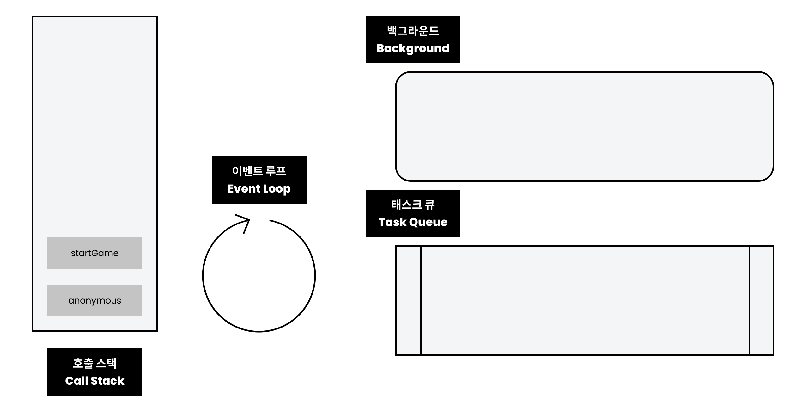
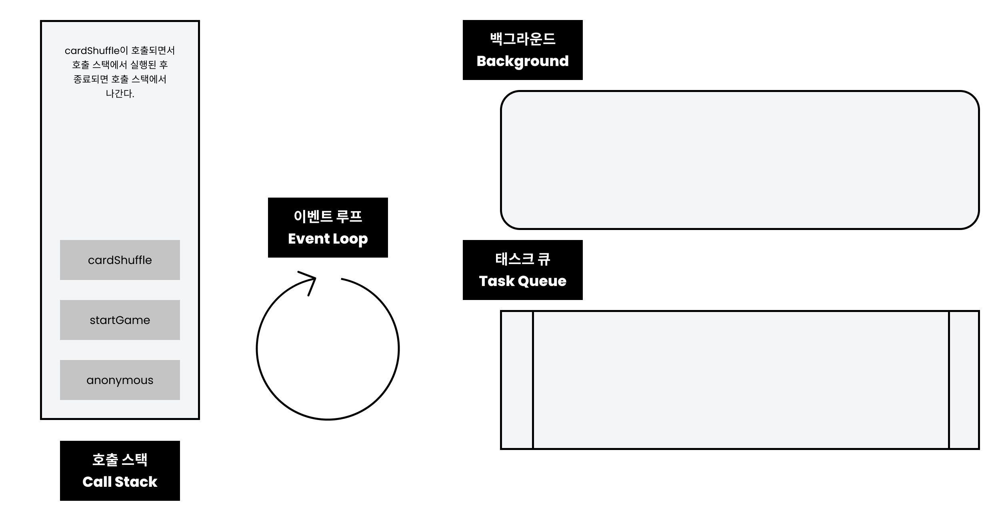
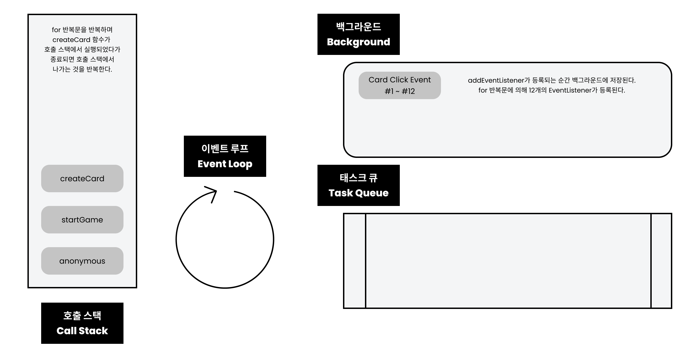
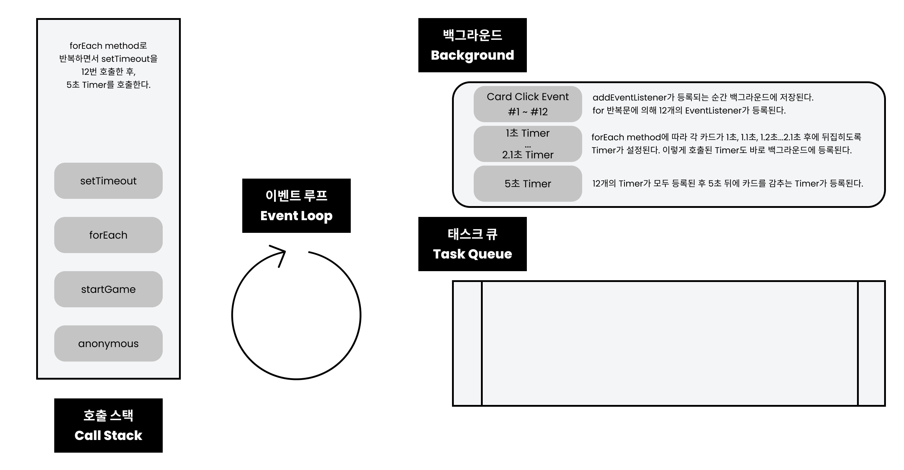
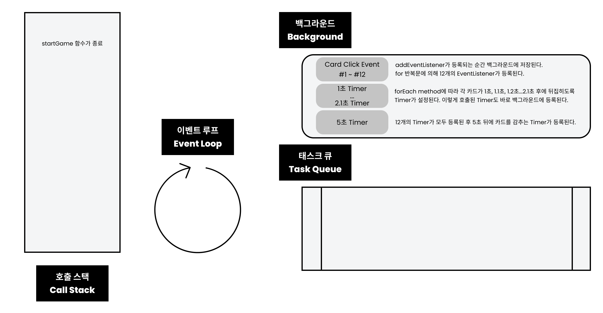

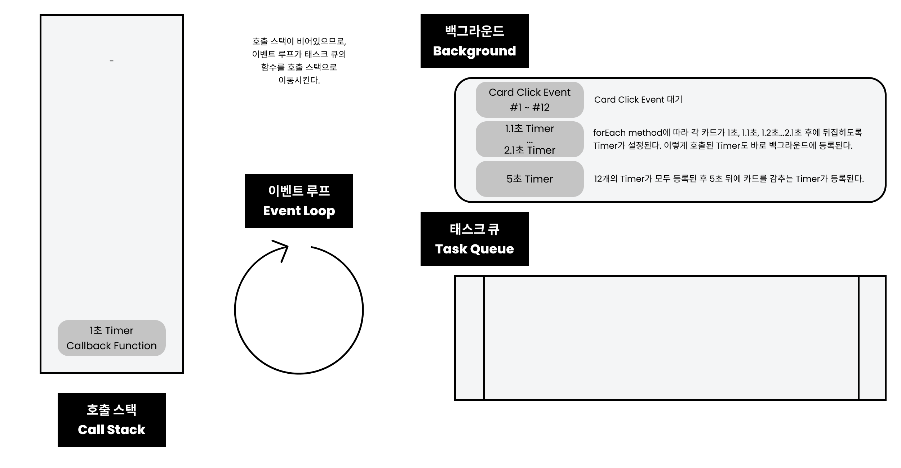
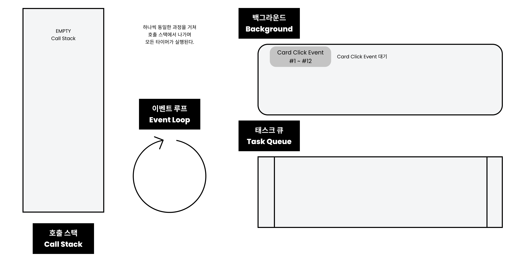
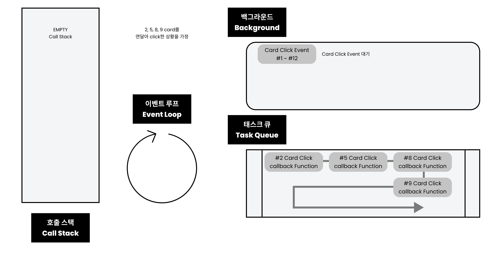
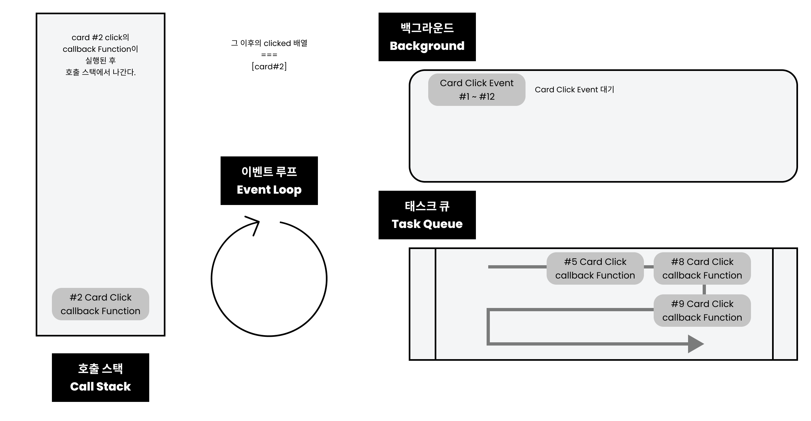


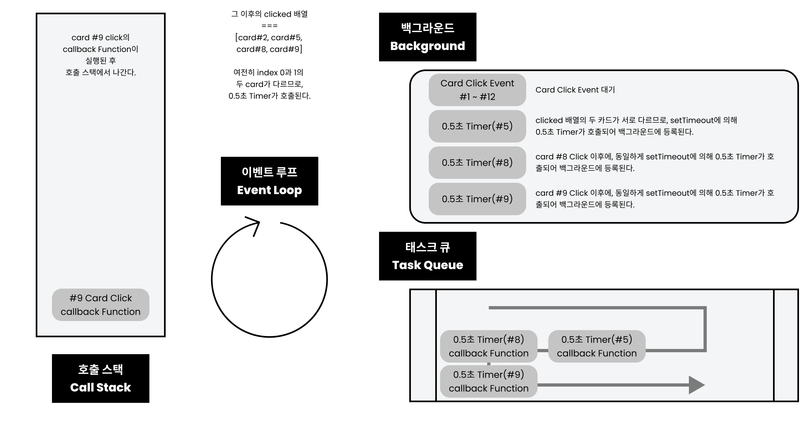
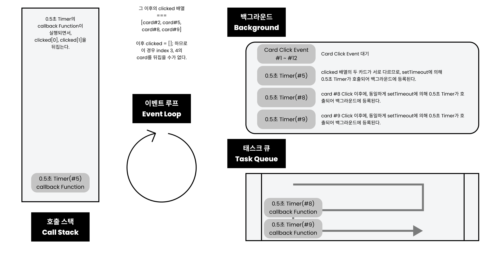

### 참고

- setTimeout이 정확하지 않은 경우
  호출 스택에 이전에 들어있는 함수가 오래 걸리는 함수여서 Timer가 지정된 시간이 지났는데도 불구하고, 해당 Timer의 callback Function이 태스크 큐에서 호출 스택으로 넘어가지 못해 실행이 늦어지는 것.

- 유의사항
  설계할 때는 순서도를 작성하는 것이 중요하고, 코드를 작성할 때는 scope에 유의해야 한다. 이후 코드를 검증할 때 호출 스택, 이벤트 루프를 파악해야 한다.

### Example Case

```js
function aaa() {
  setTimeout(() => {
    console.log("d");
  }, 0);
  console.log("c");
}

setTimeout(() => {
  console.log("a");
  aaa();
}, 0);

setTimeout(() => {
  aaa();
  console.log("b");
}, 0);

a;
c;
c;
b;
d;
d;
```

#### Call Stack

#1 anonymous -> #2 setTimeout(1) -> #4 ~~setTimeout(1)~~ -> #5 setTimeout(2) -> #7 ~~setTimeout(2)~~ -> #8 ~~anonymous~~
#13 0s Timer(1) -> #16 aaa -> #17 setTimeout(3) -> #18 console.log(c) ->

#### background

#3 0s Timer(1) -> #6 0s Timer(2) -> #10 ~~0s Timer(1)~~ -> #12 ~~0s Timer(2)~~ -> #18 0s Timer(3)

#### Task Queue

#9 0s Timer(1) -> #11 0s Timer(2) -> #14 ~~0s Timer(1)~~ ->

#### Console

#15 a -> c -> c -> b -> d -> d

www.latentflip.com/loupe

## 008. 마무리

1. 호출 스택(Call Stack)
   동기 함수만 있을 때는 호출 스택만 고려하면 된다. 함수가 호출될 때, 호출 스택에 들어가 실행이 되고, 실행이 끝나면 호출 스택에서 빠져나간다. 기존 함수의 실행이 완료되지 않았는데, 다른 함수가 호출되면 새로 호출된 함수는 기존 함수 위에 쌓이게 된다.
   처음 파일을 실행할 때 anonymous라는 익명함수가 실행된다.(Google Chrome)

2. 이벤트 루프(Event Loop)
   비동기 함수가 실행될 때는 호출 스택뿐만 아니라, 이벤트 루프까지 동원해 실행 순서를 파악해야 한다. Timer, EventListener 같은 비동기 함수는 callback Function을 백그라운드에서 태스크 큐로 보낸다. 이벤트 루프는 호출 스택이 비어 있는 경우에 태스크 큐에서 하나씩 함수를 꺼내 호출 스택으로 보내 실행한다. 즉, 호출 스택이 비어 있지 않은 경우면, 태스크 큐에 있는 함수는 실행되지 않는다.
