# JS-Web-Game

## [For FrontEnd](https://developer.mozilla.org/en-US/docs/Learn/Front-end_web_developer)

## Chapter 03. Word-relay

### 000. FlowChart


---

### 001. Rules

1. 참가자의 수를 결정한다.
2. 첫 번째 순서인 사람이 3글자 단어를 입력한다.
3. 다음 순서인 사람이 이전 순서의 사람이 입력한 단어의 마지막 글자와 동일한 글자로 시작하는 3글자 단어를 입력한다.
4. 계속 이어간다.

---

### 002. 대화 상자의 이해

1. `window.prompt()` [mdn](https://developer.mozilla.org/ko/docs/Web/API/Window/prompt)

   > `window.prompt(|message|, |default|);`

   사용자가 텍스트를 입력할 수 있도록 안내하는 선택적 메세지를 갖고 있는 대화 상자를 띄우는 method이다. 사용자가 입력한 텍스트는 문자열이므로, 숫자로 활용하기 위해서는 `parseInt()` 함수나 `Number()` 함수로 형 변환해야 한다. '취소'를 누르는 경우 `null`이 반환되고, 해당 입력 값을 활용하려면 변수에 저장해야 한다.

   - `parseInt(string, |radix|)` 함수는 문자열 인자를 특정 진수의 정수를 반환하는 함수이다. 2번째 인수인 `radix` 값이 2 미만, 36 초과인 경우 `NaN`을 반환한다.

   - `Number`는 숫자 값으로 작업할 수 있게 해주는 Wrapper 객체이다. 생성자 함수 `Number()`를 사용해서 만들 수 있다. 다만, 생성자로서 사용하지 않으면(`new` 연산자를 사용하지 않으면) `Number()`를 사용하여 형 변환을 할 수 있다. 이때 만약 인수를 숫자로 변환할 수 없으면 `NaN`을 반환한다.

   ```js
   const number = parseInt(prompt("How many person participate?"), 10);
   ```

2. `window.alert()` [mdn](https://developer.mozilla.org/ko/docs/Web/API/Window/alert)

   > `alert(|message|);`

   확인 버튼을 가지며 메시지를 지정할 수 있는 경고 대화 상자를 띄우는 method이다. 즉, 경고 대화 상자를 통해 사용자에게 어떤 메시지를 알릴 때 사용한다.
   참고로, `alert()`의 `return` 값은 `undefined`이므로, `false`이다.

   ```js
   alert(number);
   ```

3. `window.confirm()` [mdn](https://developer.mozilla.org/ko/docs/Web/API/Window/confirm)

   > `window.confirm(message);`

   확인과 취소 두 버튼을 가지며 메시지를 지정할 수 있는 모달 대화 상자를 띄우는 method로, 사용자의 의사를 물어보고, yes, no를 입력받는다. '확인'을 누르면 `true`, '취소'를 누르면 `false` 값을 반환한다.

   ```js
   const yesOrNO = confirm(number, "is right?");
   ```

---

### 003. HTML Element 선택하기

HTML Element를 선택해 저장하는 변수의 이름은 `$tagName`으로 통일하는 것을 기본으로 한다.

1. `document.querySelector()` [mdn](https://developer.mozilla.org/ko/docs/Web/API/Document/querySelector)

   > `document.querySelector(selectors)`

   해당 method는 `selectors`와 일치하는 HTML 문서 내 첫 번째 Element를 반환하고, 일치하는 요소가 없으면 `null`을 반환한다.

   ```js
   const $input = document.querySelector("input");
   ```

2. `document.querySelectorAll()` [mdn](https://developer.mozilla.org/ko/docs/Web/API/Document/querySelectorAll)

   > `document.querySelectorAll(selectors)`

   해당 method는 `selectors`와 일치하는 HTML 문서 내 Element의 목록을 나타내는 *NodeList*를 반환하고, 일치하는 요소가 없으면 비어있는 NodeList를 반환한다.

   - 이때 _NodeList_([mdn](https://developer.mozilla.org/ko/docs/Web/API/NodeList))는 유사 배열로, 0과 length를 속성 이름으로 가진 객체이다. 다만, 배열의 method, properties를 사용하지 못하는 경우도 있다.

   ```js
   const $button = document.querySelectorAll("button");
   ```

3. `selectors` [mdn](https://developer.mozilla.org/ko/docs/Web/API/Document_Object_Model/Locating_DOM_elements_using_selectors)
   `selectors`는 기본적으로 `#`은 id, `.`은 class, ` `는 자손 tag를 의미한다.

   ```js
   const $order = document.querySelector("#order");
   const $word = document.querySelector("#word");
   const $span = document.querySelector("div span");
   ```

---

### 004. Event 설정하기

1. `eventTarget.addEventListener()` [mdn](https://developer.mozilla.org/ko/docs/Web/API/EventTarget/addEventListener)

   > `eventTarget.addEventListener(type, listener)`

   `addEventListener()` method는 eventTarget에 지정한 Event(`type`)가 전달될 때마다 호출할 함수(`listener`)를 설정한다.

   - `type`([mdn](https://developer.mozilla.org/ko/docs/Web/Events))은 반응할 Event 유형을 나타내는 것으로, `focus`, `blur`, `reset`, `submit`, `mouseenter`, `click`, `dbclick`, `contextmenu` 등이 있다.
   - `listener`는 지정된 `type`의 Event가 발생한 경우, 알림(Event 인터페이스를 구현하는 객체)을 받는 객체이다. 이러한 `listener`는 콜백 함수(callback function) 또는 `handleEvent()` method가 콜백 함수(callback function: 특정 동작을 실행된 이후 연이어 추가로 실행되는 함수(ArrowFunction 가능)) 역할을 하는 EventListener를 구현하는 객체로 지정할 수 있다.
   - 함수 자체(함수 이름만)를 넣어야 하지, `()`를 통해 실행하면 안 된다는 점에 유의해야 한다. 실행하면, `return` 값이 2번째 매개변수로 삽입된다.(`return` 기본 값 = `undefined`)

   ```js
   $input.addEventListener("input", (event) => {
     console.log("글자 입력", event.target.value); // 입력 값 확인을 위해서 event 매개변수를 CallbackFunction에 추가하고, event.target.value로 확인 가능.
   });

   const onClick = function () {
     console.log("버튼 클릭");
   };
   $button.addEventListener("click", onClick);
   ```

---

### 005. Refactoring

'Refactoring'은 '결과의 변경 없이 코드의 구조를 재조정함'을 뜻한다. 주로 가독성을 높이고 유지보수를 편하게 한다. 즉, 사용자가 보는 외부 화면은 그대로 두면서 내부 논리나 구조를 바꾸고 개선하는 유지보수 행위를 말한다.

1. `||` 구문을 활용한 Refactoring

   - '제시어가 비어 있다.' && '단어가 올바르다.' => '입력한 단어가 제시어가 된다.'
   - '제시어가 비어 있다.' && '단어가 올바르지 않다.' => '입력한 단어가 제시어가 된다.'
   - '제시어가 비어 있지 않다.' && '단어가 올바르다.' => '입력한 단어가 제시어가 된다.'
   - '제시어가 비어 있지 않다.' && '단어가 올바르지 않다.' => '틀렸다고 표시한다.'

   결국, '제시어가 비어있는가?'와 '단어가 올바른가?'를 분기하는 두 if문을 `||`(또는) 으로 합칠 수 있다.

   ```js
   const onBtnClick = function () {
     if (!word || word[word.length - 1] === newWord[0]) {
       // 입력한 단어가 제시어가 된다.
     } else {
       // 틀렸다고 표시한다.
     }
   };
   ```

---

### 006. _Notes_

1. Code 작성 시 고려해야할 사항

   - 프로그램 절차의 개수는 정해져 있어야 한다.
   - 각 절차는 항상 같은 내용이어야 한다.
   - 모든 가능성을 고려해야 한다.
   - 예시는 절차를 검증할 때 사용한다.
   - 사용자의 이벤트(버튼 클릭, 입력창 입력 등)가 필요한 곳에서 순서도를 끊어주어야 한다.

2. 부가적으로 수정하거나 추가할 기능
   - (2021.07.25) prompt를 사용하지 않고, 참가자 수를 입력받는 방법에 대한 수정 필요.

---

---

## Chapter 04. Calculator

### 000. FlowChart


---

### 001. Rules

1. 숫자 btn, 연산자 btn, 숫자 btn 순으로 입력한다.
2. 연산자는 좌측 상단에, 결과값은 우측 상단에 표시한다.
3. 음수 입력을 허용한다.
4. 연속 계산을 허용한다.

---

### 002. 고차 함수(High Order Function) 사용하기

1. 고차 함수(High Order Function)의 정의와 의의

   함수를 호출할 때마다 함수를 반환하는 함수를 고차 함수라고 한다. 이렇게 반환된 함수를 다른 변수에 저장할 수 있고, 그 변수에 저장된 함수를 다시 호출할 수 있다. 또한, 반환하는 값을 변경하기 위해 매개변수(parameter)를 사용할 수 있다.

   - 하나 이상의 함수를 인자로 받거나, 함수를 결과로 반환하는 함수를 고차함수라고 한다.

   - 참고로, 화살표 함수 문법에 따라 함수의 본문에서 바로 반환되는 값이 있으면, {와 return을 생략할 수 있다.

   - 고차 함수(High Order Function)를 사용하면 보다 유연하고 반복을 줄일 수 있는 코드를 작성할 수 있다.

2. 제어 패턴 추상화(Abstracting Patterns of Control)

   - HOF는 단순히 함수의 값을 전달하는 기존 관념을 넘어, 함수의 흐름을 제어하는 파라미터로써 수용한다. 이를 제어 패턴 추상화(Abstracting Patterns of Control)라고 부른다.
   - 즉, 고차 함수(High Order Function)는 계산의 세부사항을 인자로 넘기는 함수 안에 캡슐화 하여 추상적으로 제공할 수 있도록 한다.

   ```js
   function repeat(n, fn) {
     for (let i = 0; i < n; i++) {
       fn(i);
     }
   }

   // 0부터 9999까지 출력하기
   repeat(10000, console.log);

   // 0부터 9999까지 배열에 담기
   const list = [];
   repeat(10000, (i) => {
     list.push(i);
   });
   ```

---

### 003. Refactoring

1. 중복 if 구문 제거하기

   - if문 이후의 공통된 절차를 각 분기점 내부에 넣는다.
   - 분기점에서 짧은 절차부터 실행할 수 있도록 if 구문을 작성한다.
   - 짧은 절차가 끝나면 return(함수 내부의 경우), break(for문 내부의 경우)로 중단한다.(이미 존재하는 경우, 넘어간다.)
   - else를 제거한다.
   - 반복한다.

2. 단순 중복 함수로 제거하기
   함수가 거의 유사하다면, 다른 부분을 매개변수로 처리하면 된다.

---

### 004. 추가 기능 구현하기

1. 연속 계산
   | |1|+|2|+|4|=|
   |------|-|-|-|-|-|-|
   |numOne|1|1|1|3|3|
   |operator||+|+|+|+|
   |numTwo|||2||4|
   |result||||||7|

2. 음수 입력

---

### 005. _Notes_

1. Switch <-> if <-> 조건부 삼항 연산자

2. for <-> while

---

---

## Chapter 05. NumberBaseball Game

### 000. FlowChart


---

### 001. Rules

1. 무작위로 4가지 숫자 선정하기
2. 0 ~ 9 중 중복되지 않는 4개의 숫자 입력받기
3. 순서(자리수)와 숫자를 모두 맞추면 1 Strike
4. 숫자만 맞추면 1 Ball
5. 숫자와 자리수 모두 틀리면 1 Out
6. 10회의 기회가 주어지고, 모든 기회를 소진하면 종료하기

---

### 002. `Math.random()`을 활용한 무작위 숫자 선정

`Math.random()`([mdn](https://developer.mozilla.org/ko/docs/Web/JavaScript/Reference/Global_Objects/Math/random))함수는 0 이상 1 미만의 구간에서 근사적으로 균일한(approximately uniform) 부동소숫점 의사난수를 반환한다.

- 이 값은 사용자가 원하는 범위로 변형할 수 있다. 난수 생성 알고리즘에 사용되는 초기값은 구현체가 선택하며, 사용자가 선택하거나 초기화할 수 없다.

- 암호학적으로 안전한 난수를 제공하지 않으므로, 보안과 관련된 어떤 것에도 이 함수를 사용해서는 안 된다. 그 대신 Web Crypto API의 `window.crypto.getRandomValues()` method를 이용하여야 한다.

- 따라서, 원하는 수를 곱셈과 덧셈을 활용하고, 이를 정수화(floor, ceil, round)해서 사용한다.

```js
function getRandomArbitrary(min, max) {
  return Math.random() * (max - min) + min;
}
```

```js
function getRandomInt(min, max) {
  min = Math.ceil(min);
  max = Math.floor(max);
  return Math.floor(Math.random() * (max - min)) + min; //최댓값은 제외, 최솟값은 포함
}
```

---

### 003. HTML `<form>`

#### `<form>`

HTML `<form>` ([mdn](https://developer.mozilla.org/ko/docs/Web/HTML/Element/form)) 은 정보를 제출하기 위한 대화형 컨트롤을 포함하는 문서 구획을 나타낸다. `<form>` 내부에는 `<input>`, `<label>`, `<button>` 등이 존재할 수 있다.

- 이 경우, 직접 `<form>`에 `addEventListener()` method를 사용할 수 있는데, 이때의 Event Type은 `click`이 아닌 `submit`이다.

- 또한, `<form>`은 기본 동작으로 '새로고침'이 설정되어 있으므로, 이를 `event.preventDefault();`([mdn](https://developer.mozilla.org/ko/docs/Web/API/Event/preventDefault))로 종료할 수 있다.

- `<form>` 내부에 존재하는 Element(ex. `<input>`, `<label>`, `<button>` 등) 에 접근하기 위해서 배열처럼 `event.target[0]`, `event.target[1]`, `event.target[2]`로 접근할 수 있다.

```html
<form action="" method="get" class="form-example">
  <div class="form-example">
    <label for="name">Enter your name: </label>
    <input type="text" name="name" id="name" required />
  </div>
  <div class="form-example">
    <label for="email">Enter your email: </label>
    <input type="email" name="email" id="email" required />
  </div>
  <div class="form-example">
    <input type="submit" value="Subscribe!" />
  </div>
</form>
```

---

### 004. JS 화면에 표시하기

#### `Node.textContent`

`Node` 인터페이스의 `textContent`([mdn](https://developer.mozilla.org/ko/docs/Web/API/Node/textContent)) 속성(property)은 노드와 그 자손의 Text 콘텐츠를 반환하는데, `Node`가 `document` 또는 `Doctype`이면 `null`을 반환한다. 이를 통해 해당 `Node`의 Text 컨텐츠를 변경할 수도 있다.

`innerText`와의 가장 큰 차이는 `textContent`는 `<script>`와 `<style>` 요소를 포함한 모든 요소의 콘텐츠를 가져와서 `Node`의 모든 요소를 반환한다는 점이다.

#### `Element.innerHTML`

`Element`의 `innerHTML`([mdn](https://developer.mozilla.org/ko/docs/Web/API/Element/innerHTML)) 속성(property)은 요소(element) 내에 포함 된 HTML 또는 XML 마크업을 가져오거나 설정한다. 다만, 일반 Text를 삽입 할 때는 `innerHTML` 을 사용하지 않는 것이 좋다.

#### `Document.createElement()` & `Document.createTextNode()`

`Document.createElement(tagName)`([mdn](https://developer.mozilla.org/ko/docs/Web/API/Document/createElement)) method는 HTML 문서에서 지정한 `tagName`의 HTML 요소를 만들어 반환하고, `Document.createTextNode()`([mdn](https://developer.mozilla.org/ko/docs/Web/API/Document/createTextNode)) method는 Text `Node`를 생성한다.

다만, 다른 태그에 `Element.append()`, `Node.appendChild()`하기 전까지 화면에 보이지 않는다.

#### `Element.append()`

`Element.append()`([mdn](https://developer.mozilla.org/en-US/docs/Web/API/Element/append)) method는 Element의 마지막 자식 뒤에 `Node` 객체 또는 `DOMString` 객체의 집합을 삽입한다. `Node.appendChild()`와 달리 `DOMString` 객체를 추가할 수 있고, 반환 값이 없으며, 여러 `Node`와 문자열을 함께 삽입할 수 있다는 것이 장점이다.

```js
let div = document.createElement("div");
let p = document.createElement("p");
div.append("Some text", p);
```

#### `Node.appendChild()`

`Node.appendChild()`([mdn](https://developer.mozilla.org/ko/docs/Web/API/Node/appendChild)) method는 한 `Node`를 특정 부모 `Node`의 자식 `Node` 리스트 중 마지막 자식으로 추가한다. 만약 주어진 `Node`가 이미 문서에 존재하는 `Node`를 참조하고 있다면 `Node.appendChild()` method는 `Node`를 현재 위치에서 새로운 위치로 이동시키게 된다. `Node.appendChild()`는 추가된 `Node` 객체를 반환 값으로 가지고, 단지 하나의 `Node`만 추가할 수 있다.

```js
let p = document.createElement("p");
document.body.appendChild(p);
```

---

### 005. Event 해제하기

#### `EventTarget.removeEventListener()`

`EventTarget.removeEventListener(type, listener)`([mdn](https://developer.mozilla.org/ko/docs/Web/API/EventTarget/removeEventListener)) method는 이전에 `EventTarget.addEventListener(type, listener)`로 `EventTarget`에 등록했던 Event Listener를 제거한다. 이때, Event 종류와 Listener 함수 자체의 조합으로 식별되어 제거되며, 등록 시 제공했던 다양한 옵션과 일치하는 이벤트 리스너만 제거할 수 있다.

```js
element.addEventListener("mousedown", handleMouseDown, true);
```

---

### 006. 배열 정리 #1

#### `Array.prototype.push()`

`Array.prototype.push(element1, element2, ...)`([mdn](https://developer.mozilla.org/ko/docs/Web/JavaScript/Reference/Global_Objects/Array/push)) method는 배열의 끝에 하나 이상의 요소를 추가하고, 배열의 새로운 길이를 반환한다.

```js
const sports = ["축구", "야구"];
const total = sports.push("미식축구", "수영");

console.log(sports); // ['축구', '야구', '미식축구', '수영']
console.log(total); // 4
```

#### `Array.prototype.splice()`

`Array.prototype.splice(start, deleteCount, |item1, item2, ...|)`([mdn](https://developer.mozilla.org/ko/docs/Web/JavaScript/Reference/Global_Objects/Array/splice)) method는 배열의 기존 요소를 삭제 또는 교체하거나 새 요소를 추가하여 배열의 내용을 변경한다.

`start`는 배열의 변경을 시작할 index, `deleteCount`는 배열에서 제거할 요소의 수를 의미한다. 만약 `deleteCount`를 생략하거나 값이 `array.length - start`보다 크면 `start`부터의 모든 요소를 제거하고, `deleteCount`가 `0` 이하라면 어떤 요소도 제거하지 않는다.

부가적으로 `item1, item2, ...`는 배열에 추가할 요소를 의미한다. 아무 요소도 지정하지 않으면 `splice()`는 요소를 제거하기만 한다.

```js
let myFish = ["angel", "clown", "trumpet", "sturgeon"];
let removed = myFish.splice(0, 2, "parrot", "anemone", "blue");

// myFish is ["parrot", "anemone", "blue", "trumpet", "sturgeon"]
// removed is ["angel", "clown"]
```

#### `Array.prototype.join()`

`Array.prototype.join(seperator)`([mdn](https://developer.mozilla.org/ko/docs/Web/JavaScript/Reference/Global_Objects/Array/join)) method는 배열의 모든 요소를 연결해 하나의 문자열로 만들어, 배열의 모든 요소들을 연결한 하나의 문자열을 반환한다.

이때, `seperator`는 배열의 각 요소를 구분할 문자열을 지정하는데, 생략하면 배열의 요소들이 '쉼표'로 구분된다.

```js
const a = ["바람", "비", "불"];
const myVar1 = a.join(); // '바람,비,불'
const myVar2 = a.join(", "); // '바람, 비, 불'
const myVar3 = a.join(" + "); // '바람 + 비 + 불'
const myVar4 = a.join(""); // '바람비불'
```

`String.prototype.split(seperator)`([mdn](https://developer.mozilla.org/ko/docs/Web/JavaScript/Reference/Global_Objects/String/split)) method는 `String` 객체를 지정한 구분자를 이용하여 여러 개의 문자열로 나누어, 주어진 문자열을 `separator`마다 끊은 부분 문자열을 담은 배열을 반환한다.

#### `Array.prototype.indexOf()`

`Array.prototype.indexOf(searchElement, |fromIndex|)`([mdn](https://developer.mozilla.org/ko/docs/Web/JavaScript/Reference/Global_Objects/Array/indexOf)) method는 배열에서 지정된 요소를 찾을 수 있는 첫 번째 인덱스를 반환하고 존재하지 않으면 -1을 반환한다. 이때, `searchElement`는 배열에서 찾을 요소를 의미하고, `fromIndex`는 검색을 시작할 index를 의미한다.

```js
const array = [2, 9, 9];
array.indexOf(2); // 0
array.indexOf(7); // -1
array.indexOf(9, 2); // 2
array.indexOf(2, -1); // -1
array.indexOf(2, -3); // 0
```

#### `Array.prototype.includes()`

`Array.prototype.includes(valueToFind, |fromIndex|)` ([mdn](https://developer.mozilla.org/ko/docs/Web/JavaScript/Reference/Global_Objects/Array/includes)) method는 배열이 특정 요소를 포함하고 있는지 판별하여 해당 요소를 포함하고 있으면, `true`를 반환하고, 포함하지 않는 경우에는 `false`를 반환한다. 이때, `valueToFind`는 배열에서 찾을 요소(대소문자 구분)를 의미하고, `fromIndex`는 검색을 시작할 index를 의미한다.

```js
[1, 2, 3].includes(2); // true
[1, 2, 3].includes(4); // false
[1, 2, 3].includes(3, 3); // false
[1, 2, 3].includes(3, -1); // true
[1, 2, NaN].includes(NaN); // true
```

#### `Array.prototype.forEach()`

`Array.prototype.forEach((element, index) => {})`([mdn](https://developer.mozilla.org/ko/docs/Web/JavaScript/Reference/Global_Objects/Array/forEach)) method는 주어진 함수를 배열 요소 각각에 대해 실행한다.

`Array.prototype.forEach(callback)` 인수로는 콜백 함수(callback Function)가 들어가고, 해당 함수의 매개변수(parameter)로 해당 Array의 요소 값(`element`)과 index 번호(`index`)가 들어간다. 이러한 `element`, `index`를 통해 해당 Array에 콜백 함수(callback Function)의 동작문을 적용할 수 있다.

#### `Array.prototype.map()`

`Array.prototype.map((element, index) => { return })`([mdn](https://developer.mozilla.org/ko/docs/Web/JavaScript/Reference/Global_Objects/Array/map)) method는 배열 내의 모든 요소 각각에 대하여 주어진 함수를 호출한 결과를 모아 **새로운 배열**을 반환한다.

`Array.prototype.map(callback)`의 인수로 콜백 함수(callback Function)가 들어가고, 해당 콜백 함수(callback Function)의 매개변수(parameter)로 동일하게 해당 Array의 요소 값(`element`)과 index 번호(`index`)가 들어간다. 이를 통해 해당 Array에 해당 함수 `return` 값으로 새로운 Array를 만든다. 다만, 기존 배열은 수정되지 않는다는 특징이 있다.

#### `Array.prototype.fill()`

`Array.prototype.fill(value, |start, end|)` ([mdn](https://developer.mozilla.org/ko/docs/Web/JavaScript/Reference/Global_Objects/Array/fill)) method는 배열의 시작 index(`start`)부터 끝 index(`end`)의 이전까지 정적인 값(`value`) 하나로 채운다. 이때 배열을 채울 값인 `value`를 입력하지 않으면 `undefined`로 채워진다.

```js
[1, 2, 3].fill(4); // [4, 4, 4]
[1, 2, 3].fill(4, 1); // [1, 4, 4]
[1, 2, 3].fill(4, 1, 2); // [1, 4, 3]
[1, 2, 3].fill(4, 1, 1); // [1, 2, 3]
[1, 2, 3].fill(4, 3, 3); // [1, 2, 3]
[1, 2, 3].fill(4, -3, -2); // [4, 2, 3]
[1, 2, 3].fill(4, NaN, NaN); // [1, 2, 3]
[1, 2, 3].fill(4, 3, 5); // [1, 2, 3]
Array(3).fill(4); // [4, 4, 4]
```

#### `Array(number)`

`Array.length = number`인 빈 배열을 작성하는 방법이다.

---

### _Notes_

1. 알고리즘
   우선, '인간'이라면 어떻게 했을 지에 대해 생각한 후 더 효율적인 방안이 있는지 파악하고, 이를 코드로 작성하면 된다. 다만, 관련된 지식을 가지고 있어야 한다.
   보통 30 이하의 수를 찾거나 정렬하는 경우 처음 생각한대로 해도 효율적이다.
   이후 예시를 통한 검증 과정을 거치면서 예외를 확인하여 고칠 수 있다.

2. Code 작성 시 고려해야할 사항
   나중에 코드를 수정할 때 한 변수를 수정하는 경우 연이어 수정해야 하는 경우를 방지하기 위해 변수를 연결하는 것이 중요하다. 즉, 추후 수정할 것도 염두에 둔 코드를 작성해야 한다.

3. `stopPropagation()`: 현재 이벤트가 상위로 전파되는 것을 막는 것이다.
   `stopImmediatePropagation()`: 현재 이벤트가 상위뿐만 아니라 현재 레벨에 걸린 다른 이벤트도 동작하지 않도록 중단하는 것이다.

4. `Set()` ([mdn](https://developer.mozilla.org/ko/docs/Web/JavaScript/Reference/Global_Objects/Set))
   Set 객체는 자료형에 관계 없이 원시 값과 객체 참조 모두 유일한 값을 저장할 수 있는
   중복을 허용하지 않는 특수한 배열이다. 요소의 개수를 구하기 위해 `length` method가 아닌 `size` method를 사용한다.

5. HTML의 검증
   `required`, `minlength = '4'`, `maxlength = '4'`, `pattern = "^(?!._(.)._\1)\d{4}$>`([정규표현식 참고](https://github.com/ziishaned/learn-regex)) 등을 통해 `<input>`의 값을 검증할 수 있다.
   다만, 최근에는 HTML의 검증이나, `prompt()`, `alert()` 등은 활용하지 않는 추세이다.

---

---

## Chapter 6. Lotto

### 000. FlowChart


---

### 001. Rules

1. 1 ~ 45 사이의 숫자를 대상으로 한다.
2. 당첨 번호 6개를 무작위로 추출한다.
3. 보너스 번호 1개를 무작위로 추출한다.
4. Timer를 활용해 1초 간격으로 추출한다.

---

### 002. 비동기 개념과 Timer

#### 비동기(Asynchronous)

실제 코드를 작성한 순서와 다르게 동작하는 코드를 의미(예: EventListner, Timer 등) -> 순서도 상의 대기 이후에 실행되는 코드
([mdn](https://developer.mozilla.org/en-US/docs/Learn/JavaScript/Asynchronous))
two or more objects or events not existing or happening at the same time (or multiple related things happening without waiting for the previous one to complete)
이전 항목이 완료될 때까지 기다리지 않고 발생하는 여러 관련 작업

#### `WindowOrWorkerGlobalScope.setTimeout()`

`WindowOrWorkerGlobalScope.setTimeout(function, milliseconds)`([mdn](https://developer.mozilla.org/ko/docs/Web/API/WindowOrWorkerGlobalScope/setTimeout)) method는 정해진 Timer의 시간(단위: `ms`)이 지난 후에 함수 또는 작성된 코드를 실행하는 Timer를 설정한다.

다만, 기본적으로 javascript는 한 번에 한 가지 일만 수행할 수 있기 때문에, 이미 다양한 일을 수행하고 있다면 설정한 시간이 되어도 지정된 작업이 수행되지 않고, 기존에 하던 작업이 종료된 후에 수행된다.

---

### 003. Fisher-Yates Shuffle

전체 배열을 무작위로 정렬하고, 앞에서 원하는 개수만큼 추출하면 무작위로 해당 개수만큼 선정한 것이 된다.

즉, 먼저 무작위 index를 하나 선정한 후, 그에 해당하는 요소를 새로운 배열로 옮기는 작업을 반복해 새 배열에 무작위로 섞인 숫자를 정렬하는 방법이다.

```js
// 1 ~ 45까지의 숫자 준비하기
const candidate = Array(45)
  .fill()
  .map((element, index) => index + 1);
const shuffle = [];

while (candidate.length > 0) {
  // 무작위 index 선정
  const randomIndex = Math.floor(Math.random() * candidate.length);
  // splice의 결과값은 앞에서 선정한 index에 해당하는 요소 값으로 이루어진 배열
  const spliceArray = candidate.splice(randomIndex, 1);
  // 해당 splice 결과값 배열의 요소를 value로 할당
  const value = spliceArray[0];
  // value 값을 shuffle Array에 넣기
  shuffle.push(value);
}

console.log(shuffle);
```

---

### 004. 배열 정리 #2

#### `Array.prototype.slice()`

`Array.prototype.slice(begin, |end|)`([mdn](https://developer.mozilla.org/ko/docs/Web/JavaScript/Reference/Global_Objects/Array/slice)) method는 어떤 배열의 begin부터 end까지(end 미포함)에 대한 얕은 복사본을 새로운 배열 객체로 반환하고, 원본 배열은 수정되지 않는다. 이때 `begin`은 0을 시작으로 하는 추출 시작점에 대한 index를 의미하고, `end`는 추출을 종료 할 기준 index를 의미한다.

```js
let fruits = ["Banana", "Orange", "Lemon", "Apple", "Mango"];
let citrus = fruits.slice(1, 3);

// fruits = ['Banana', 'Orange', 'Lemon', 'Apple', 'Mango']
// citrus = ['Orange','Lemon']
```

#### `Array.prototype.sort()`

`Array.prototype.sort(|compareFunction|)`([mdn](https://developer.mozilla.org/ko/docs/Web/JavaScript/Reference/Global_Objects/Array/sort)) method는 배열의 요소를 `compareFunction`에 따라 적절한 위치에 정렬한 후 그 배열을 반환한다. 새로운 배열을 만드는 것이 아니라 원본 배열을 정렬한 후 반환한다는 점에 유의해야 한다.

원본 배열을 비교함수에 따라 정렬한다.

- `(a, b) => a - b` : 오름차순(숫자, 날짜)
- `(a, b) => b - a` : 내림차순(숫자, 날짜)

문자열도 정렬할 수 있다.

- `(a, b) => a[0].charCodeAt() - b[0].charCodeAt()` : 첫 문자 알파벳 순
- `(a, b) => b[0].charCodeAt() - a[0].charCodeAt()` : 첫 문자 알파벳 역순
- `(a, b) => a.localeCompare(b)` : 사전 순
- `(a, b) => b.localeCompare(a)` : 사전 역순

```js
array = [3, 2, 9, 7, 5, 8, 6, 4, 1];
array.slice().sort((a, b) => {
  console.log(a, b, a - b);
  return a - b;
})[(1, 2, 3, 4, 5, 6, 7, 8, 9)];
```

즉, `(a - b)`가 `0`보다 크면, b -> a 순서로, `0`보다 작으면, a -> b 순서로 정렬된다.

원본 배열을 수정하지 않고 정렬을 하기 위해서는 `Array.slice().sort(...);`를 사용하면 된다.

---

### 005. Scope 이해: Function Scope & Block Scope

Scope란 어느 범위까지 참조하는지, 변수와 매개변수(parameter)의 접근성과 생존 기간을 의미한다. 크게 2가지 Scope가 있는데, script 전체에서 참조되는 **전역 유효 범위(Global Scope)**, 정의된 함수 내에서만 참조되는 **지역 유효 범위(Local Scope)**이다.

만약 변수 또는 다른 표현식이 해당 Scope 내에 있지 않다면, 사용할 수 없다.

변수의 Scope(해당 변수에 접근할 수 있는 범위)는 선언에 따라 다른데, `var`로 선언한 변수는 **함수 유효 범위(Function Scope)**, `let`, `const`으로 선언한 변수는 **블록 유효 범위(Block Scope)**를 갖는다.

따라서, `if`, `for`, `while` 등에서는` var`로 선언한 변수는 해당 Block 외부에서도 접근할 수 있으나, `let`으로 선언한 변수에는 접근할 수 없다.

```javascript
for (var i = 0; i < winBalls.length; i++) {
    setTimeout(() => {
      console.log(winBalls[i], i);
      drawLotto(winBalls[i], $lottoResult);
    }, (i + 1) * 1000);
  }

(6) undefined 6
```

```
<코드의 실행 순서>
  i = 0, setTimeout(callback 0, 1000) 실행(Timer 등록)
  i = 1, setTimeout(callback 1, 2000) 실행(Timer 등록)
  i = 2, setTimeout(callback 2, 3000) 실행(Timer 등록)
  i = 3, setTimeout(callback 3, 4000) 실행(Timer 등록)
  i = 4, setTimeout(callback 4, 5000) 실행(Timer 등록)
  i = 5, setTimeout(callback 5, 6000) 실행(Timer 등록)
  i = 6,
  1초 후 callback(0) 실행(i = 6)
  2초 후 callback(1) 실행(i = 6)
  3초 후 callback(2) 실행(i = 6)
  4초 후 callback(3) 실행(i = 6)
  5초 후 callback(4) 실행(i = 6)
  6초 후 callback(5) 실행(i = 6)
```

이와 달리 `let`으로 변수를 선언하면, 해당 `for`문 block에 변수 `i`가 고정되어 callback 함수 내부의 `i`와 `setTimeout`의 `i`가 같은 값이 된다.

`var`으로 해결하기 위해서는 `closer`(함수(setTimeout)와 함수 외부의 변수(`i`) 간의 관계)문제를 해결해야 한다.(`var`, 비동기가 결합된 문제)

```javascript
for (var i = 0; i < winBalls.length; i++) {
  (function (j) {
    setTimeout(() => {
      console.log(winBalls[j], j);
      drawLotto(winBalls[j], $lottoResult);
    }, (j + 1) * 1000);
  })(i);
}
```

즉, 새로운 function으로 Function Scope에 맞는 `j`를 활용해 이를 매개변수로 설정하고, 새로운 function의 인수로 `j`를 활용하면 된다. 이때 함수를 소괄호()로 감싸고, 실행하면 즉시 실행된다.

### 006. 기능 추가하기

1. 추첨 이전에 Lotto를 직접 구매한다고 생각하고, 특정 숫자를 입력하고, 추첨된 번호와 일치 여부를 판단해 등수 매기기

2. 숫자 야구에서 반복문을 통해 몇 번 무작위 추첨이 있어야 당첨되는지 여부 확인하기, 몇 번 이내에 맞추면 등수와 상품을 알려주기

### 007. _Notes_

1. `while`, `for`
   조건이 간단한 경우 while을 사용하면 더 간결하게 작성할 수 있고, for는 명확한 반복 범위가 존재할 때 사용하면 더 쉽게 작성할 수 있다.

---

---

## Chapter 07. RSP game

### 000. FlowChart


---

### 001. Rules

1. 무작위로 컴퓨터가 가위, 바위, 보 중 하나를 제시한다.
2. 사용자가 click한 btn에 맞는 가위, 바위, 보를 입력한다.
3. 이를 비교하여 승리하면 +3, 비기면 +1, 지면 +0의 점수를 입력한다.
4. 15점을 먼저 낸 쪽이 승리한다.

---

### 002. 상대경로와 절대경로

1. 상대 경로(relative path)
   `./`: current folder
   `../`: parent folder

2. 절대 경로(absolute path, full path)
   `/`: C drive

---

### 003. Image sprite

요청의 효율성과 속도를 높이기 위해 사용하는 기법으로, 여러 개의 이미지를 하나로 합쳐 사용하는 방법을 의미한다.

---

### 004. Object의 기초

공통점을 가진 여러 변수를 묶어 객체([mdn](https://developer.mozilla.org/ko/docs/Learn/JavaScript/Objects/Basics))로 표현한다. 즉, 관련된 data와 function(일반적으로 여러 data와 function로 이루어지는데, 객체 안에 있을 때는 보통 property와 method라고 부릅니다)의 집합이다.

```javascript
const rspX = {
  rockX = '-220px',
  scissorsX = '-0',
  paperX = '-440px',
};
```

이를 객체 리터럴(object literal)이라고 한다. 객체를 생성할 때 컨텐츠를 그대로 대입하는 방식으로 생성하므로, 클래스로부터 생성하는 방식과는 다르다.

또한, 객체 리터럴(object literal)을 사용해서 객체를 생성하는 것은 연속된 구조체나 연관된 데이터를 일정한 방법으로 변환하고자 할 때 자주 사용한다. 즉, 각 아이템들을 하나 하나 개별 전송하는 것보다, 하나의 객체를 전송하는 것이 훨씬 효율적이고, 각 아이템들을 이름으로 구분해서 사용하기 원할 때도 배열을 사용하는 것보다 훨씬 쉽게 중복 변수명 문제를 해결하고, 그룹화하여 관리할 수 있다는 장점을 갖고 있다.

객체의 property, method에 접근하기 위해서 '점 표기법' 혹은 '괄호 표기법'을 활용한다.

```js
rspX.rockX;
rspX.scissorsX;
rspX.paperX;
```

```js
rspX["rockX"];
rspX["scissorsX"];
rspX["paperX"];
```

또한, 객체에 다음과 같이 새로운 data를 추가할 수 있다.

```js
rspX.result = 0;
rspX["winScore"] = 3;
rspX["drawScore"] = 1;
rspX["defeatScore"] = 0;
```

#### this

`this`는 지금 동작하고 있는 코드를 가지고 있는 객체를 의미한다. 객체의 Context가 변경되는 경우에도 언제나 정확히 실행중인 해당 코드를 가지고 있는 객체 자기 자신을 가리킬 수 있기 때문에 객체 이름을 사용하지 않고 `this`를 사용한다.

`this`는 객체 리터럴(object literal)을 직접 지정해서 사용하는 경우보다 동적으로 객체를 생성하는 경우(생성자를 사용해 생성하는 경우)에 더 유용하다.

---

### 005. `WindowOrWorkerGlobalScope.setInterval()`

`WindowOrWorkerGlobalScope.setInterval(intervalFunction, ms)`([mdn](https://developer.mozilla.org/en-US/docs/Web/API/WindowOrWorkerGlobalScope/setInterval)) method를 통해서 일정 시간마다 함수를 반복적으로 호출하거나 코드 조각을 실행할 수 있다.

이 또한, 내부 `intervalFunction`의 동작 시간이 설정된 시간을 초과하는 경우에는 내부의 `intervalFunction`이 전부 실행된 이후에 즉시 다음 interval이 실행된다.(다만, 간격을 보장하고자 최대한 노력한다.)

`setInterval()`의 `return` 값은 `intervalID` 값으로, `clearInterval(ID)`를 활용해 해당 interval을 제거할 수 있다. 이와 유사하게 `setTimeout()` 함수도 `return` 값을 활용해 `clearTimeout(ID)` 함수로 취소할 수 있으나, `setTimeout()` 함수에 인수로 넣은 함수가 실행되기 전에 `clearTimeout(ID)`을 호출해야 한다.

```javascript
let idInterval = setInterval(Function, ms);
clearInterval(idInterval);

let idTimeout = setTimeout(Function, ms);
clearTimeout(idTimeout);
```

```js
let intervalId = setInterval(changeComputerRSP, 50);

const clickRSPBtn = () => {
  if (clickable) {
    clearInterval(intervalId);
    clickable = false;
  }
};
```

`WindowOrWorkerGlobalScope.setTimeout()`을 재귀(함수가 자신을 다시 호출하는 함수) 사용하여 같은 효과를 낼 수 있다.(다만, 해당 간격 이상만 되면 상관 없는 경우에 사용한다. 즉, 내부 함수가 모두 실행된 후에 재귀함수가 호출되기 때문에 설정한 시간 이후 다시 실행된다.)

```js
let computerChoice = "rock";

const changeComputerRSP = () => {
  if (computerChoice === "rock") {
    // rock
    computerChoice = "scissors";
  } else if (computerChoice === "scissors") {
    // scissors
    computerChoice = "paper";
  } else if (computerChoice === "paper") {
    // paper
    computerChoice = "rock";
  }
  $RSPComputer.style.background = `url(${IMG_URL}) ${rspX[computerChoice]} 0`;
  $RSPComputer.style.backgroundSize = "auto 200px"; // Error 방지를 위해 작성
  setTimeout(changeComputerRSP, 50); // 재귀함수
};

setTimeout(changeComputerRSP, 50);
```

---

### 006. button click bug 수정하기

`changeComputerRSP`에 의해 변경되는 그림이 멈춘 동안 button을 여러번 클릭하면, 더 빠르게 변경되고, 이후에 button을 클릭해도 멈추지 않는 것을 볼 수 있다.

즉, button을 누를 때마다, `setTimeout()` 함수가 호출되기 때문에, 여러번 button을 클릭하면 Timer가 여러 개 동작하게 되고, 이를 제거하지 않기 때문에 문제가 된다.

또한, button을 5번 클릭한 경우, `intervalId`에 마지막 button 클릭에 의한 `setInterval()` 함수의 `id` 값이 저장되기 때문에 다음 button 클릭 시 마지막 Interval만 제거되어 앞의 4번의 Interval에 의해 계속 돌아가게 된다.

1. bug 제거 방법 #1
   button 클릭 가능하나, 계속 타이머 제거
   `clearInterval(intervalId)`으로 타이머 제거

2. bug 제거 방법 #2
   button 클릭 자체가 불가능

   ```js
   $RSPRock.removeEventListener("click", clickRSPBtn);
   $RSPScissors.removeEventListener("click", clickRSPBtn);
   $RSPPaper.removeEventListener("click", clickRSPBtn);
   ```

   배열과 객체는 동일한 선언문으로 선언하더라도 `===`으로 비교하면, `false`가 반환된다. 따라서, 고차함수에서 `return` 값으로 내부 함수를 EventListener에 연결했을 때, 다시 제거하면 제대로 동작하지 않는다. 이를 해결하기 위해서는 변수에 넣어 참조해주는 경우에만 같은 함수로 제거 동작이 제대로 실행된다.

3. bug 제거 (3) 추천!
   `flag` 변수 활용를 활용해 `if` 문을 활용해 분기를 생성해서 click은 가능하나 내부 코드가 실행되지 않게 할 수 있다.

   ```js
   let clickable = true;
   const clickRSPBtn = () => {
     if (clickable) {
       clearInterval(intervalId);
       clickable = false;
       // 점수 계산 및 화면 표시
       setTimeout(() => {
         clickable = true;
         intervalId = setInterval(changeComputerRSP, 50);
       }, 1000);
     }
   };
   ```

### 007. `event.target.textContent` 활용

`event.target.textContent`로 user가 선택한 가위, 바위, 보를 조회할 수 있다.

```js
const myChoice =
  event.target.textContent === "RSP__rock"
    ? "rock"
    : event.target.id === "RSP__scissors"
    ? "scissors"
    : "paper";
```

### 008. 점수 계산하기

총 9가지의 경우의 수를 나열하기 위해 9번의 if문을 작성해야 한다.

```js
const myChoice = event.target.id; // user가 선택한 RSP
let score = 0;
if (myChoice === "RSP__rock") {
  if (computerChoice === "RSP__rock") {
    score += 1;
  } else if (computerChoice === "RSP__scissors") {
    score += 3;
  } else if (computerChoice === "RSP__paper") {
    score += 0;
  }
} else if (myChoice === "RSP__scissors") {
  if (computerChoice === "RSP__rock") {
    score += 0;
  } else if (computerChoice === "RSP__scissors") {
    score += 1;
  } else if (computerChoice === "RSP__paper") {
    score += 3;
  }
} else if (myChoice === "RSP__paper") {
  if (computerChoice === "RSP__rock") {
    score += 3;
  } else if (computerChoice === "RSP__scissors") {
    score += 0;
  } else if (computerChoice === "RSP__paper") {
    score += 1;
  }
}

$RSPScore.textContent = Number($RSPScore.textContent) + score;
```

다만 이렇게 작성하면, 코드의 중복이 심하고, 간결하지 않기 때문에 새로운 규칙을 만드는 것이 좋다.

문자열을 기준으로 하는 경우에는, 숫자를 대입하여 사칙 연산의 결과값을 기준으로 분기를 나누면 더 쉽고 간결한 코드를 작성할 수 있다.

```js
const RSPScoreTable = {
  RSP__rock: 0,
  RSP__scissors: 1,
  RSP__paper: -1,
};

const myScore = RSPScoreTable[myChoice];
const computerScore = RSPScoreTable[computerChoice];
const diff = myScore - computerScore;

if (diff === 2 || diff === -1) {
  score += 3;
} else if (diff === 0) {
  score += 1;
} else if (diff === 1 || diff === -2) {
  score += 0;
}

$RSPScore.textContent = Number($RSPScore.textContent) + score;
```

### 009. _Notes_

1. `if-else` 구문에서 약간의 오탈자로 인해 Error가 발생할 수 있으니, 가능하다면 `else`보다 `else if`로 조건을 작성해주는 것이 좋다.

2. `||`을 활용한 코드는 배열의 includes method로 더 간결하게 표현할 수 있다.

   ```js
   diff === 2 || diff === -1;
   ```

   ```js
   [2, -1].includes(diff);
   ```

   ```js
   [2, -1].indexOf(diff) > -1;
   ```

3. jsfuck(난독화), codegolf(간결화)

---

---

## Chapter 08. Response Speed Test

시간 측정을 위해서 시간과 관련된 Method인 Date 객체를 사용한다. 이후 반응 속도를 기록하여 평균을 내고 화면에 표시한다.

---

### 000. Flow Chart

## 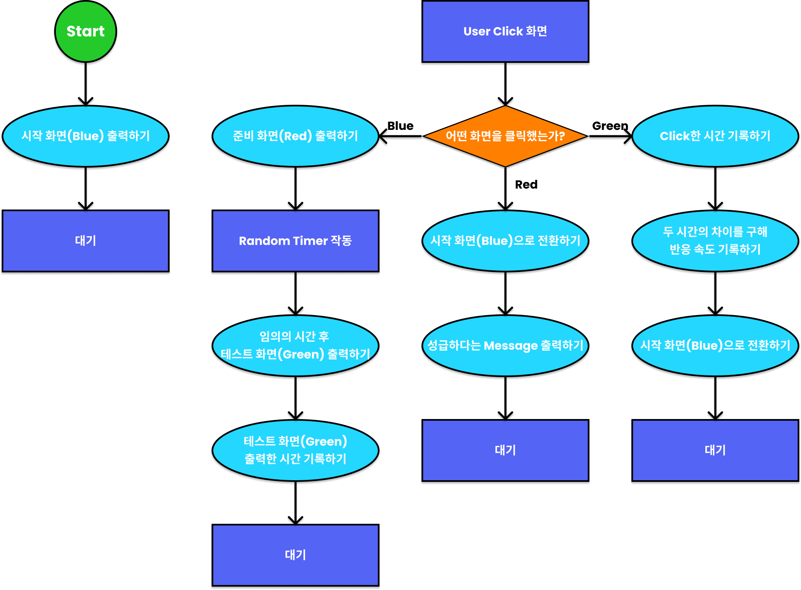

### 001. Rules

1. 시작 화면(Blue) 표시
2. Click시 준비 화면(Red) 표시
3. 임의의 시간 이후 테스트 화면(Green) 표시
4. 테스트 화면이 출력된 시간과 테스트 화면을 Click 한 시간의 차이를 구해 반응 속도를 측정.
5. 준비 화면에서 Click 시, 성급 Message 출력 후 다시 시작 화면으로 돌아감.

---

### 002. `Element.classList`, `Element.className`

화면의 색 별로 다르게 동작하기보다, 해당 화면에 부여된 `className`에 따라 다르게 동작하도록 구현하는 것이 좋다.

따라서, CSS에서 미리 설정해둔 `className`인 `'ready'`, `'set'`, `'go'`를 구분해야 한다. 이러한 경우 두 가지 방법으로 `className`을 확인할 수 있다. `Element.className` ([mdn](https://developer.mozilla.org/ko/docs/Web/API/Element/className))이나 `Element.classList`의 `contains` method를 활용할 수 있다.

```js
$ResponseScreen.className === "className"; // true

$ResponseScreen.classList.contains("className"); // true
```

이때 `classList`에서 `className`를 추가/수정/제거하기 위해서 `add("className")`, `replace("className__remove", "className__add")`, `remove("className")`, `toggle("className)` ([mdn](https://developer.mozilla.org/ko/docs/Web/API/Element/classList)) method를 활용할 수 있다.

```js
$ResponseScreen.classList.add("className");
$ResponseScreen.classList.replace("className__remove", "className__add");
$ResponseScreen.classList.remove("className");
$ResponseScreen.classList.toggle("className");
```

---

### 003. `Date` 객체를 활용해 시간 기록하기

현재 시간은 `new` 예약어와 `Date`([mdn](https://developer.mozilla.org/ko/docs/Web/JavaScript/Reference/Global_Objects/Date)) 객체를 통해 기록할 수 있다. `Date` 객체는 '1970년 1월 1일 UTC(협정 세계시)' 자정과의 시간 차이를 `ms`로 나타낸다.

```js
new Date();
```

특정 시간을 지정하고 싶다면, 인수로 삽입하면 된다. 다만 유의해야할 점은 '월'은 `0`부터 시작한다.

```js
new Date(2021, 7, 2, 8, 55, 33);

< Mon Aug 02 2021 08:55:33 GMT+0900 (한국 표준시)
```

이렇게 시작 시간과 종료 시간을 기록하여 차이를 구하면, `ms` 단위로 결과값이 반환된다. `Date()`의 기준은 '1970년'이므로, 현재에 가까울수록 더 크기가 크다.

---

### 004. 배열 정리 #3

#### `Array.prototype.reduce()`

`Array.prototype.reduce(callbackFunction, |initialValue|)`([mdn](https://developer.mozilla.org/ko/docs/Web/JavaScript/Reference/Global_Objects/Array/Reduce)) method는 배열의 각 요소에 대해 주어진 'reducer 함수'(사실상 콜백 함수(callback Function))를 실행하고, 하나의 결과값(누적 결과값)을 반환한다. 즉, 빈 요소를 제외하고 배열 내에 존재하는 각 요소에 대해 콜백 함수(callback Function)를 한 번씩 실행한다.

'reducer 함수'는 4가지의 인수를 받는다.

- 콜백 함수(callback Function)의 반환값을 누적받는 `accumulator`
- 처리할 현재 요소를 의미하는 `currentValue`
- 처리할 현재 요소의 index를 의미하는 `currentIndex`, 다만, `initialValue`를 제공한 경우에는 `currentIndex = 0`, 제공하지 않은 경우에는 `currentIndex = 1`부터 시작한다.
- `reduce()` method를 호출한 배열인 `array`

따라서 배열의 평균을 구하기 위해서는 누적 결과값으로 모든 요소를 더한 값을 반환하고, 이를 해당 배열의 길이로 나누면 된다.

```js
array.reduce((a, c) => a + c) / array.length;
```

```js
const array = [1, 2, 3, 4];
array.reduce((a, c) => a + c, 0);
   // a: accumulator, c: currentValue
   // a = 0, c = 1 -> a + c = 1
   // a = 1, c = 2 -> a + c = 3
   // a = 3, c = 3 -> a + c = 6
   // a = 6, c = 4 -> a + c = 10

< 10
```

이 경우 `initialValue`을 제공하면, `accumulator`는 `initialValue`와 동일하고, `currentValue`는 배열의 첫 번째 값이 된다.

반면에, `initialValue`을 제공하지 않았다면, `accumulator`는 배열의 첫 번째 값이 되고, `currentValue`는 배열의 두 번째 값이 된다.

```js
const array = [1, 2, 3, 4];
array.reduce((a, c) => a * c, 1);
   // a: accumulator, c: currentValue
   // a = 1, c = 1 -> a * c = 1
   // a = 1, c = 2 -> a * c = 2
   // a = 2, c = 3 -> a * c = 6
   // a = 6, c = 4 -> a * c = 24

< 24
```

`reduce()` method를 활용해 배열을 객체로 변경할수도 있다.

```js
const arr = ['James', 'Smith', 'Bread', 'Tom']
arr.reduce((a, c, i) => { a[i] = c; return a }, {});
   // a = {}, i = 0, c = 'James' => { 0: 'James' }
   // a = { 0: 'James' }, i = 1, c = 'Smith' => { 0: 'James', 1: 'Smith' }
   // a = { 0: 'James', 1: 'Smith' }, i = 2, c = 'Bread' => { 0: 'James', 1: 'Smith', 2: 'Bread' }
   // a = { 0: 'James', 1: 'Smith', 2: 'Bread' }, i = 3, c = 'Tom' => { 0: 'James', 1: 'Smith', 2: 'Bread', 3: 'Tom' }

< { 0: 'James', 1: 'Smith', 2: 'Bread', 3: 'Tom' }
```

---

### 005. 잘못 click한 경우 message 표시하기

단순히 `className`을 변경하고, `textContent`를 수정한다면, bug가 발생한다.

따라서, `clearTimeout(timeoutId)`을 통해 Timer를 초기화한 후, `className`을 변경하고, `textContent`를 수정해야 한다.

---

### 006. 기능 추가하기

속도 순으로 정렬하기(완)
다시시작 Btn 만들기

---

### 007. _Notes_

1. `debugger`를 활용하기
   `debugger`를 활용해서 해당 코드 순서의 정보를 확인할 수 있다.

2. 비동기 작성 시 유의사항
   비동기의 경우 *변수 선언 순서*에 유의해야 한다.

---

---

## Chapter 09. Tic-Tac-Toe game

### 000. FlowChart


---

### 001. Rules

1. user가 선공으로 3X3 표 중 1칸을 선택한다.
2. 컴퓨터가 임의로 빈 칸을 선택한다.
3. 가로, 세로, 대각선으로 3개를 연달아 동일한 자신의 표식을 입력하면 승리한다.
4. 승부가 가려지지 않고, 9개의 칸을 모두 채우면 무승부가 된다.

---

### 002. 2차원 배열 준비하기

배열 안의 배열이 구성되어 있는 것을 2차원 배열이라고 한다. 보통 '표'는 2차원 배열로 표현할 수 있다.

2차원 배열은 `for` 문을 활용해서 작성하는 것이 크기에 상관없이 작성할 수 있기 때문에 더 좋다.

```js
const 2_dimension_array = [];
for (let i = 0; i < ('Length you want'); i++) {
  2_dimension_array.push([]);
}
```

이렇게 배열을 설정한 후에는 표를 그리기 위해, `<table>`, `<tr>`, `<td>`를 활용해야 한다.

```js
const $table = document.createElement("table");

for (let i = 0; i < "Length you want"; i++) {
  const $tr = document.createElement("tr");
  for (let j = 0; j < "Length you want"; j++) {
    const $td = document.createElement("td");
    $tr.append($td);
  }
  $table.append($tr);
}

document.body.append($table);
```

다른 방법으로, 빈 배열 `rows`, `cells`를 활용해 2차원 배열을 만들 수 있다.

```js
const rows = [];

for (let i = 0; i < 5; i++) {
  const cells = [];

  for (let j = 0; j < 4; j++) {
    cells.push("cellsContents");
  }
  rows.push(cells);
}
```

---

### 003. 구조 분해 할당(Destructuring)

구조 분해 할당 구문([mdn](https://developer.mozilla.org/ko/docs/Web/JavaScript/Reference/Operators/Destructuring_assignment))은 배열이나 객체의 속성을 해체하여 그 값을 개별 변수에 담을 수 있게 하는 JavaScript 표현식이다.

```js
const body = document.body;
```

`{}`를 활용해 구조 분해 할당을 하면 다음과 같다.

```js
const { body } = document;
```

객체인 `document` 내에 `body` 속성이 있는 경우에, 간결하게 작성하는 문법으로, 객체의 속성을 변수에 할당할 때 해당 속성과 변수 명이 동일한 경우에 사용할 수 있다. 이러한 객체 구조 분해 할당은 같은 객체 내에 존재하는 여러 속성을 모두 각각 동일한 변수명으로 할당할 때 특히 유용하다.

```js
const body = document.body;
const createElement = document.createElement;
```

동일한 객체 내에 존재하는 다른 속성을 더 간결하게 변수에 할당할 수 있다.

```js
const { body, createElement, querySelector } = document;
```

이러한 객체 구조 분해 할당은 특정 index의 값을 변수에 할당할 때 배열에서도 활용할 수 있다.

```js
const arr = [1, 2, 3, 4, 5];
const one = arr[0];
const three = arr[2];
const four = arr[3];
const five = arr[4];
```

구조 분해 할당을 하는 경우 자릿수가 일치해야 한다는 점에 유의해야 한다.

```js
const [one, , three, four, five] = arr;
```

```js
const obj = {
  a: 1,
  b: {
    c: 2,
    d: { e: 3 },
  },
};
```

```js
const {
  a,
  b: {
    c,
    d: { e },
  },
} = obj;
```

---

### 004. Event Bubbling과 Event Capturing

`<td>`에 직접 eventListener를 추가하면, 이후에 완전히 게임이 종료된 이후에는 각각 9개 모두 제거해주어야 한다. 따라서, eventListener를 한 번으로 작성하고, 제거할 수 있는 경우 이를 활용해야 한다.

즉, 9개의 `<td>`에 eventListener를 추가하는 것이 아니라, `<table>`에 하나의 eventListener를 추가해도 동일하게 동작한다. 그 이유는 `event.target`이 `<td>`로 고정되어 있기 때문이다. 즉, `<td>`에서 발생한 click Event가 부모 태그인 `<tr>`, `<table>`, `<body>`에 전달되는 것을 'Event Bubbling'이라고 하는데, 이러한 현상이 발생해 Event가 전달되기 때문이다.

'Event Bubbling'이 발생하면, `event.target`은 실제로 click한 태그가 되고, eventListener를 추가한 태그를 선택하려면, `event.currentTarget`를 활용해야 한다.

만약 Event Bubbling을 방지하려면, `event.stopPropagation()`([mdn](https://developer.mozilla.org/ko/docs/Web/API/Event/stopPropagation)) method을 추가하면 Bubbling 현상을 막을 수 있다.

이와 반대로 부모 태그의 Event가 자식 태그에 전달되는 것을 'Event Capturing'이라고 하는데, 이는 보통 popup을 닫을 때 사용한다.

---

### 005. 순서에 맞게 표식 작성하고, 순서 변경하기

`event.target.textContent`를 활용해서 click Event가 발생한 `<td>` 태그에 현재 순서의 표식을 작성할 수 있다.

```js
event.target.textContent = currentTurn;
```

이후에 해당 순서의 표식을 기준으로 **조건부 삼항 연산자**를 활용해서 순서를 변경해줄 수 있다.

```js
currentTurn = currentTurn === "❌" ? "⭕" : "❌";
```

---

### 006. 칸이 비어있는지 확인하기

해당 칸이 비어있는지 여부를 확인하기 위해서는 `removeEventListener`를 통해 해당 eventListener를 제거하거나, if 문과 `return`을 통해 함수를 종료할 수 있다.

```js
if (event.target.textContent) {
  return;
}
```

다만, 매번 eventListener를 추가하고 제거하는 것은 error를 발생시킬 수 있기 때문에 if문과 `return`을 활용하는 것이 더 좋다.

---

### 007. 승부가 났는지 확인하기

승부가 났는지 확인하기 위해 `checkWinner()` 함수를 만들어야 한다. 이때, click 위치의 index를 알아야 하고, 가로줄, 세로줄, 대각선을 순차적으로 검사하여 승부를 가리고, 승리한 사람이 있다면, 처음 설정한 `hasWinner` 값을 `true`로 변경해야 한다.

#### click 위치의 index 파악하기

click한 `<td>` 태그의 위치를 파악하기 위해 해당 2차원 배열의 index를 `Array.prototype.forEach()` method를 활용해서 파악할 수 있다.

```js
let rowIndex;
let cellIndex;

array.forEach((row, ridx) => {
  row.forEach((cell, cidx) => {
    if (cell === event.target) {
      rowIndex = ridx;
      cellIndex = cidx;
    }
  });
});
```

##### `Node.parentNode`

다만, 몇 번째 줄, 몇 번째 칸인지 알아내는 더 쉬운 방법이 존재한다. `parentNode`([mdn](https://developer.mozilla.org/en-US/docs/Web/API/Node/parentNode)) property는 현재 태그의 부모 태그를 선택하는 속성이다.

##### `HTMLTableRowElement.rowIndex`, `HTMLTableCellElement.cellIndex`

이를 활용해 `<td>`의 부모 태그인 `<tr>`을 선택하고, `<tr>` 태그는 `rowIndex` 속성을 제공해, 몇 번째 줄인지 파악할 수 있다. 또한, `<td>` 태그는 `cellIndex` 속성을 통해 몇 번째 칸인지 파악할 수 있게끔 해준다.

```js
const rowIndex = target.parentNode.rowIndex;
const cellIndex = target.cellIndex;
```

##### `Element.children`

이와 반대로, `Element.children` 속성은 자식 태그를 선택하는 속성인데, 여러 개의 자식 태그를 배열 처럼 생긴 객체인 유사 배열 객체(array-like object)로 반환한다. 이러한 유사 배열 객체는 `indexOf`, `forEach`, `map`, `filter`, `reduce`와 같은 method를 활용할 수 없는데, `Array.from()`을 활용해 배열로 변경한 후에는 해당 method를 사용할 수 있다.

#### 가로줄 검사

가로로 3개가 동일한 표식을 가졌을 때를 확인하려면 선택한 칸의 `rowIndex`를 활용해 파악할 수 있다.

```js
if (
  rows[rowIndex][0].textContent === currentTurn &&
  rows[rowIndex][1].textContent === currentTurn &&
  rows[rowIndex][2].textContent === currentTurn
) {
  hasWinner = true;
}
```

#### 세로줄 검사

세로로 3개가 동일한 표식을 가졌을 때를 확인하려면 선택한 칸의 `cellIndex`를 활용해 파악할 수 있다.

```js
if (
  rows[0][cellIndex].textContent === currentTurn &&
  rows[1][cellIndex].textContent === currentTurn &&
  rows[2][cellIndex].textContent === currentTurn
) {
  hasWinner = true;
}
```

#### 대각선 검사

대각선으로 동일한 표식을 가지는 경우는 단 2가지이므로, 이를 index를 활용해 나타낼 수 있다.

```js
if (
  rows[0][0].textContent === currentTurn &&
  rows[1][1].textContent === currentTurn &&
  rows[2][2].textContent === currentTurn
) {
  hasWinner = true;
} else if (
  rows[0][2].textContent === currentTurn &&
  rows[1][1].textContent === currentTurn &&
  rows[2][0].textContent === currentTurn
) {
  hasWinner = true;
}
```

#### 결과 표시

승리자가 있는 경우, `hasWinner` 변수를 `true`로 변경하고, 이를 반환하면 된다.

```js
hasWinner = true;

return hasWinner;
```

#### 무승부 확인하기

`hasWinner` 변수가 `false` 값을 가지면서, 모든 `<td>` 칸에 `textContent`가 존재하는 경우 무승부이다.

```js
let draw = true;
rows.forEach((row) => {
  row.forEach((cell) => {
    if (!cell.textContent) {
      draw = false;
    }
  });
});
if (draw) {
  $tictactoeResult.textContent = `무승부`;
  return;
}
```

### 008. 배열 정리 #4

다만, `Array.prototype.forEach()` method를 두 번 모두 반복해야 하기 때문에, 맨 처음 칸만 비어있는 경우 비효율적인 동작을 해야 한다.

따라서 배열의 method인 `Array.prototype.every()`, `Array.prototype.flat()`([mdn](https://developer.mozilla.org/ko/docs/Web/JavaScript/Reference/Global_Objects/Array/flat))를 활용하면 더 효율적인 코드를 작성할 수 있다.

보통 알고리즘 문제를 해결할 때, 필요한 것을 검색하거나 제거하거나 추가한 후에는 더이상 비효율적인 동작을 하지 않도록 작성하는 것이 정답에 가깝다.

하지만, `Array.prototype.every()` method는 1차원 배열에만 적용되기 때문에, 2차원 배열을 `Array.prototype.flat()` method를 활용해 1차원 배열로 만든 후에 해당 method를 사용해야 한다.

```js
rows.flat().every((td) => {td.textContent});

< false
```

따라서 모든 `<td>` 태그에 `textContent`가 존재하는 경우에만 `true`가 반환된다. 만약 `some` method를 사용하면, 하나라도 `textContent`가 존재하는 경우에 `true`가 반환되고, 모든 태그에 `textContent`가 없는 경우에만 `false`가 반환된다.

```js
rows.flat().some((td) => {td.textContent});

< false
```

즉, `every` method는 반복문의 일종으로 요소를 순회하면서 조건 함수의 반환 값이 모두 `true`인 경우에만 `true`를 반환하고, 조건 함수의 반환 값이 하나라도 `false`인 경우에는 `every` method도 `false`를 반환한다. 이와 달리 `some` method는 조건 함수의 반환 값이 모두 `false`인 경우에만, `false`를 반환하고, 조건 함수의 반환 값이 하나라도 `true`인 경우에는 `true`를 반환한다.

#### `Array.prototype.every()`

`Array.prototype.every(callbackFunction)`([mdn](https://developer.mozilla.org/ko/docs/Web/JavaScript/Reference/Global_Objects/Array/every)) method는 배열 안의 모든 요소가 주어진 판별 함수(`callbackFunction`)를 통과하는지 테스트하여 `Boolean` 값을 반환한다. 즉, `callbackFunction`에 의해 모든 요소가 모두 `true`이면, `Array.prototype.every()` method가 `true`를 반환하고, 그렇지 않으면 `false`를 반환한다.

이때, `callbackFunction(element, |index, array|)`은 세 가지 인수를 받는다. 우선, `element`는 배열에서 처리되는 현재 요소를 의미하고, 선택 인수인 `index`는 처리할 현재 요소의 index를 의미한다. 마지막으로 선택 인수인 `array`는 `Array.prototype.every()` method를 호출한 해당 배열을 의미한다.

```js
function isBigEnough(element, index, array) {
  return element >= 10;
}
[12, 5, 8, 130, 44].every(isBigEnough); // false
[12, 54, 18, 130, 44].every(isBigEnough); // true
```

#### `Array.prototype.some()`

`Array.prototype.some(callbackFunction)`([mdn](https://developer.mozilla.org/ko/docs/Web/JavaScript/Reference/Global_Objects/Array/some)) method는 배열 안의 어떤 요소라도 주어진 판별 함수(`callbackFunction`)를 통과하는지 테스트하여 `Boolean` 값을 반환한다. 즉, `callbackFunction`에 의해 배열 안의 어떤 요소 하나라도 `true`이면, `Array.prototype.some()` method가 `true`를 반환하고, 그렇지 않으면 `false`를 반환한다.

참고로, 빈 배열에서 호출하면 무조건 `false`를 반환한다.

`Array.prototype.every()`와 동일하게 `callbackFunction(element, |index, array|)`은 세 가지 인수를 받는다. 우선, `element`는 배열에서 처리되는 현재 요소를 의미하고, 선택 인수인 `index`는 처리할 현재 요소의 index를 의미한다. 마지막으로 선택 인수인 `array`는 `Array.prototype.some()` method를 호출한 해당 배열을 의미한다.

```js
function isBiggerThan10(element, index, array) {
  return element > 10;
}
[2, 5, 8, 1, 4].some(isBiggerThan10); // false
[12, 5, 8, 1, 4].some(isBiggerThan10); // true
```

#### `Array.prototype.flat()`

`Array.prototype.flat()`([mdn](https://developer.mozilla.org/ko/docs/Web/JavaScript/Reference/Global_Objects/Array/flat)) method는 모든 하위 배열 요소를 지정한 깊이까지 재귀적으로 이어붙인 새로운 배열을 생성한다. 즉, 하위 배열을 이어붙인 새로운 배열을 반환하는 method이다.

```js
const arr1 = [1, 2, [3, 4]];
arr1.flat();
// [1, 2, 3, 4]

const arr2 = [1, 2, [3, 4, [5, 6]]];
arr2.flat();
// [1, 2, 3, 4, [5, 6]]

const arr3 = [1, 2, [3, 4, [5, 6]]];
arr3.flat(2);
// [1, 2, 3, 4, 5, 6]

const arr4 = [1, 2, [3, 4, [5, 6, [7, 8, [9, 10]]]]];
arr4.flat(Infinity);
// [1, 2, 3, 4, 5, 6, 7, 8, 9, 10]
```

배열의 빈 칸을 제거하는 데 사용할 수도 있다.

```js
const arr5 = [1, 2, , 4, 5];
arr5.flat();
// [1, 2, 4, 5]
```

---

### 009. Bug 수정하기

#### 승리 메시지 이후에도 Click이 되는 Bug

따라서, 승리 이후 `$table`의 eventListener를 제거해야 한다.

```js
$tictactoeTable.removeEventListener("click", callback);
```

---

### 010. 기능 추가하기

1. 컴퓨터 차례 구현하기
   user 순서 이후에 비어있는 칸 중 무작위로 다른 표식을 입력하게 해야 한다.

2. 그나마 지능 구현하기

---

### 011. 마무리

#### 2차원 배열

배열 내부에 배열이 있는 경우를 2차원 배열이라고 하는데, 이는 표, 엑셀, 데이터베이스 등에서 활용한다. 이러한 다차원 배열은 `Array.prototype.flat()` method로 1차원 배열로 변환할 수 있다.

#### 구조 분해 할당

객체 내부의 속성과 할당하는 변수명이 같을 때 구조 분해 할당을 통해 간결하게 작성할 수 있다. 또한, 여러 개의 속성을 동시에 변수에 할당할 수 있다. 배열에서도 구조 분해 할당을 할 수 있다.

#### Event Bubbling & Event Capturing

Event가 발생할 때 부모 태그에도 동일한 Event가 발생하는 현상을 Bubbling이라고 한다. 즉, `<td>` 태그에서 발생한 click event가 `<table>` 태그까지 전달되는 것을 의미한다. 이러한 현상이 발생하면 `eventListener`의 `callback` 함수의 `event.target`이 event가 발생한 태그로 변경되고, 현재 `eventListener`가 연결된 태그를 선택하기 위해서는 `event.currentTarget`을 활용해야 한다.

#### `Node.parentNode` & `Element.children`

현재 태그의 부모 태그를 조회할 때는 `Node.parentNode` 속성을, 자식 태그를 조회할 때는 `Element.children` 속성을 활용한다. 다만, `Element.children` 속성은 유사 배열 객체이므로, `Array.from`([mdn](https://developer.mozilla.org/ko/docs/Web/JavaScript/Reference/Global_Objects/Array/from))을 통해 배열로 변경해 배열 method를 활용할 수 있다.

#### `HTMLTableRowElement.rowIndex` & `HTMLTableCellElement.cellIndex`

`<tr>`은 몇 번째 줄인지 알려주는 HTMLTableRowElement.`rowIndex` 속성을 가지고 있고, `<td>`는 몇 번째 칸인지 알려주는 `HTMLTableCellElement.cellIndex` 속성을 가지고 있다.

#### `Array.prototype.every()` & `Array.prototype.some()`

배열에서 모든 값이 조건에 해당하는 지 판단하려면 `Array.prototype.every()` method를 사용하고, 하나라도 조건에 해당하는 지 판단하려면 `Array.prototype.some()` method를 사용한다. 일반 반복문으로 충분히 구현할 수 있으나, 일반 반복문에서는 조건에 맞는 값을 찾아도 끝까지 탐색하기 때문에 `Array.prototype.every()`, `Array.prototype.some()` method가 더 효율적으로 작동한다.

`Array.prototype.every()` method는 하나라도 조건을 만족하지 않는 요소(조건 함수가 `false`인 `return`)를 찾으면 반복을 중단하고, `Array.prototype.some()` method는 하나라도 조건을 만족하는 요소(조건 함수가 `true`인 `return`)를 찾으면 반복을 중단한다.

---

---

## Chapter 10. Text RPG game

### 000. FlowChart

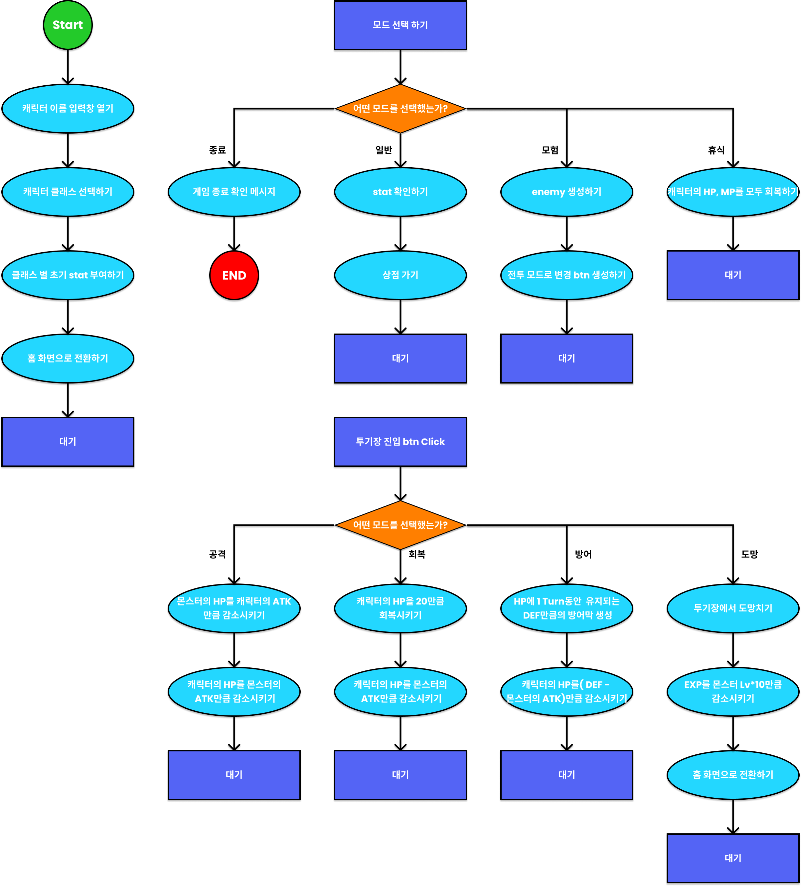

---

### 001. Rules

1. 일반 게임 메뉴 : go Shop, go Adventure, Time to rest, End game
2. 모험 메뉴 : Attack, Heal, Defense, Run
3. 승리 시 : gain experience point(exp) -> Lv up -> Attack, HP, DEF up
4. 패배 시: game over
5. 공격 시: Attack과 Defense 비교 후 HP 감소
6. 방어 시: Attack과 Defense 비교 후 HP 감소
7. 회복 시: HP + 20

---

### 002. HTML 구성하기

`<form>`을 활용해서, `<input>`, `<button>`를 작성하고, 각각 `id`, `class`를 활용해 작성해야 한다.

각각 시작 화면('#start\_\_screen'), 캐릭터 정보 화면('#hero\_\_stat'), 일반 모드 화면('#game\_\_menu'), 전투 모드 화면('#battle\_\_menu'), 몬스터 정보 화면('#monster\_\_stat') 총 5가지 화면으로 구성된다.

---

## 003. HTML 화면 전환하기

`style` 속성을 조작해 화면을 전환할 수 있다. 즉, `style.display = 'none'`을 통해 시작 화면을 숨기고, 일반 모드 화면을 `style.display = 'block'`을 통해 보이게 만들 수 있다.

---

## 004. 등장인물의 정보 입력하기

객체를 활용해서 캐릭터와 몬스터의 stats을 설정한다.

```js
const heroInitialStats = [
  {
    name: "",
    job: "warrior",
    lv: 1,
    maxHp: 100,
    hp: 100,
    exp: 0,
    atk: 10,
    def: 20,
    item: "",
  },
  {
    name: "",
    job: "archer",
    lv: 1,
    maxHp: 80,
    hp: 80,
    exp: 0,
    atk: 20,
    def: 10,
    item: "",
  },
  {
    name: "",
    job: "assassin",
    lv: 1,
    maxHp: 70,
    hp: 70,
    exp: 0,
    atk: 30,
    def: 5,
    item: "",
  },
];

const monsterList = [
  { name: "slime", hp: 25, atk: 10, exp: 10, def: 0 },
  { name: "ghost", hp: 20, atk: 10, exp: 20, def: 30 },
  { name: "skeleton", hp: 45, atk: 15, exp: 20, def: 20 },
  { name: "onePig", hp: 50, atk: 30, exp: 30, def: 15 },
];
```

---

## 005. `<form>` 내부의 `input` 값 가져오기

`<form>` 내부의 `<input>`의 값을 가져오기 위해서는, dot notation이 아니라, `[]`와 id 값을 활용해 접근해야 한다.

```js
const name = event.target["start__input"].value;
```

---

## 006. JSON.stringfy, JSON.parse

parse method는 문자열을 객체로, stringfy method는 객체를 문자열로 변경하는 method이다. 다만, 두 method를 조합하여 사용하면 대상 객체를 깊은 복사(Deep Copy)할 수 있다.

```js
const monster1 = JSON.parse(JSON.stringfy(monsterList[0])); // 깊은 복사
const monster2 = monsterList[0];  // 참조
const monster3 = { ...monster[0] }; // 얕은 복사(객체 리터럴)

monster1.name = '이름 변경하기1';
monster2.name = '이름 변경하기2';

monsterList[0] === monster1;
monsterList[0] === monster2;

< false
< true
```

깊은 복사를 한 경우에는 원래 객체와 서로 다른 객체가 되어 깊은 복사를 한 `monster1`을 수정해도 원래 객체인 `monsterList`에 아무런 영향이 가지 않는다. 이와 달리 단순히 참조한 경우에는 `monster2`를 수정하면 두 객체가 연결되어 있기 때문에 원래 객체인 `monsterList`도 수정된다.

깊은 복사는 객체의 내/외부가 모두 참조 관계가 모두 끊기고 다른 객체로 복사하는 반면에, 얕은 복사(Shallow Copy)를 한 객체는 가장 바깥의 객체는 참조 관계가 끊겨 새로운 객체로 복사되는데, 내부의 객체는 참조 관계가 유지된다. 이러한 얕은 복사는 `spread` 문법을 활용해 할 수 있다.(배열의 경우, `slice` method로 얕은 복사를 할 수 있다.)

```js
const a = [];
const b = "hello";
const c = {};
const arr = [a, b, c];

const arr1 = arr; // 참조
const arr2 = JSON.parse(JSON.stringfy(arr)); // 깊은 복사
const arr3 = [...arr]; // 얕은 복사

arr1[1] = "hi";
arr2[1] = "hi";
arr3[1] = "hi";

arr === arr1; // true
arr === arr2; // false
arr === arr3; // false
```

즉, 단순히 얕은 복사한 배열의 요소를 변경하는 것은 깊은 복사와 마찬가지로 다른 객체/배열이 되어 2번째 요소가 변경되고, 기존 배열과 같지 않다.

```js
arr1[0].push(1);
arr2[0].push(1);
arr3[0].push(1);

arr === arr1; // true
arr === arr2; // true
arr === arr3; // false
```

다만, 첫 번째 요소인 빈 배열에 새로운 요소를 추가하는 경우에는, 얕은 복사를 하면 내부의 참조 관계가 유지되기 때문에, 해당 배열이 기존 배열에서도 변경된다.

즉, 얕은 복사를 하면, 객체가 아닌 원시값(string, number, boolean, `null`, `undefined`)은 복사가 되고, 배열이나 객체 리터럴 등의 객체는 참조가 된다. 원시값은 다른 변수에 할당하면, 복사가 되기 때문이다.

따라서 객체 내부의 객체까지 복사하기 위해서는 깊은 복사를 활용해야 한다.

참고)

1. 원시값(string, number, boolean, `null`, `undefined`)은 단순히 다른 변수에 할당하는 것만으로도 복사가 되고, 복사된 값을 변경해도 원본이 변경되지 않는다.

2. 내부에 객체가 들어있지 않은 배열은 `slice`, `concat` method를 통해 복사할 수 있고, 내부에 객체가 들어있지 않은 객체 리터럴은 `...` 연산자를 활용해 `spread` 문법으로 복사할 수 있다.

3. 내부에 객체가 들어있는 객체는 깊은 복사를 활용해 내부 객체도 복사해야 한다.

4. 간단한 객체는 `JSON.parse(JSON.stringfy(object))`로 깊은 복사를 할 수 있지만, 성능도 느리고 함수, `Math`, `Date` 등의 객체를 복사할 수 없기 때문에 실무에서는 `lodash clone`과 같은 라이브러리를 활용한다.

---

## 007. 객체 내부에 method 구현하기

기본적으로 `this`는 브라우저에서의 `window`를 가리킨다.

하지만, 객체 내부에 method를 구현할 때, 자기 자신을 가리키기 위해 `this`를 활용한다. 객체 내부에서만 `this`가 객체 자기 자신을 가리키기 때문이다. 활용할 때에도 `objectName.method()`를 통해 해당 method를 사용할 수 있는데 이때에만 `this`가 자기 자신(`objectName`)을 의미한다.

이러한 객체의 method를 구현할 때, 화살표 함수를 사용하면, `this`가 본래 의미 그대로 `window`를 가리키기 때문에 제대로 작동하지 않기 때문에 사용하면 안 된다.

객체 리터럴 내부에서 `function` method를 구현하는 경우 `function` 예약어와 `:`를 생략할 수 있다.

```js
const add = {
  result: 0;
  a: 1,
  b: 2,
  c: 3,
  add: function(number) {
    result += (number + a + b + c);
  };
}
```

```js
const add = {
  result: 0;
  a: 1,
  b: 2,
  c: 3,
  add(number) {
    result += (number + a + b + c);
  };
}
```

## 008. 전투 모드 구현하기 / 클래스 문법

```js
heroInitialStats.attack(monster);
monster.attack(heroInitialStats);
```

이처럼 user의 캐릭터와 임의로 생성된 몬스터 사이의 `attack`과 `defense`, `heal` method를 각각 구현하면 이후 추가적인 캐릭터와 몬스터의 등장에 있어서 지속적으로 method를 생성해야 하기 때문에, 코드의 간결성을 해치게 된다. 따라서 객체와 객체의 상호작용이 많은 경우에는 클래스 문법을 활용해야 한다.

이처럼 지속적으로 유사한 특성의 객체(`monster`, `hero`)를 만들어야 하거나, 상호작용(`attack`, `defense`)이 빈번하게 일어나는 경우에는 클래스 문법을 활용해 간결하고 효율적인 코드를 작성할 수 있다.

클래스 이전에는 함수(Factory function)를 활용해 객체를 만들 수 있었다.

```js
function createMonster(name, hp, exp, atk, def) {
  return {
    name,
    hp,
    exp,
    atk,
    def,
    attack(monster) {
      monster.hp -= this.atk;
      this.hp -= monster.atk;
    },
    heal(monster) {
      this.hp += 20;
      this.hp -= monster.atk;
    },
  };
}
const monster1 = createMonster("slime", 25, 10, 10, 5);
const monster2 = createMonster("slime", 45, 20, 10, 5);
const monster3 = createMonster("slime", 50, 15, 30, 10);
```

다만, 객체를 생성할 때 서로 참조 관계가 아니라 다른 객체여야 한다는 점이 중요하다. 같은 객체를 참조하여 반환하면, 하나를 수정할 때 다른 객체도 모두 수정되기 때문에 위 함수(Factory function)은 매번 새로운 객체를 반환할 수 있도록 객체 리터럴로 return 값을 만들었다.

나아가 `this`와 생성자 함수를 활용해 객체를 만들 수도 있다.

```js
function Monster(name, hp, exp, atk, def) {
  this.name = name;
  this.hp = hp;
  this.exp = exp;
  this.atk = atk;
  this.def = def;
}

Monster.prototype.attack = function (monster) {
  monster.hp -= this.atk;
  this.hp -= monster.atk;
};

Monster.prototype.heal = function (monster) {
  this.hp += 20;
  this.hp -= monster.atk;
};

const monster1 = new Monster("slime", 25, 10, 10, 5);
const monster2 = new Monster("slime", 45, 20, 10, 5);
const monster2 = new Monster("slime", 50, 15, 30, 10);
```

생성자 함수 앞에 `new` 키워드를 사용하면, `this`가 `window`가 아니라, 가상의 새로운 객체를 가리키게 되고, 해당 생성자 함수의 `return` 값이 해당 새로운 객체의 속성 값을 수정하여 객체가 된다. 따라서 생성자 함수를 활용하기 위해서는 `new`가 필수적이다.(`new`를 붙이지 않고 생성자 함수를 호출하면, `this`가 `window`가 되어 `window.name`이 변경되기 때문에 반드시 `new`를 붙여야 한다.)

첫 글자로 대문자를 사용하는 것이 반드시 지켜야할 규칙은 아니지만, `new Set();`, `new Date();` 와 같이 대문자를 사용하는 것이 암묵적인 약속이다.

이후 생성자 함수를 더 편하게 사용할 수 있도록 클래스 문법을 도입되었다.

```js
class Monster {
  constructor(name, hp, exp, atk, def) {
    this.name = name;
    this.hp = hp;
    this.exp = exp;
    this.atk = atk;
    this.def = def;
  }
}

const monster1 = new Monster("slime", 25, 10, 10, 5);
const monster2 = new Monster("slime", 45, 20, 10, 5);
const monster3 = new Monster("slime", 50, 15, 30, 10);
```

`class` 예약어로 클래스를 선언하고, `constructor` method 내부에 기존 코드를 작성하면 된다. 이후 클래스에 `new`를 붙여 호출하면 `constructor` 함수가 실행되고, 객체가 반환된다.(`new`를 생략한 경우 error 발생) 여기서 `this`는 생성된 객체 자기 자신을 가리키게 된다.

이러한 클래스 문법에서는 객체의 method(화살표 함수 불가능)를 같이 묶을 수 있다는 점이 큰 장점이다.

```js
class Monster {
  constructor(name, hp, exp, atk, def) {
    this.name = name;
    this.hp = hp;
    this.exp = exp;
    this.atk = atk;
    this.def = def;
  }
  attack(monster) {
    monster.hp -= this.atk;
    this.hp -= monster.atk;
  }
  heal(monster) {
    this.hp += 20;
    this.hp -= monster.atk;
  }
}
```

Factory function의 경우에는 객체를 생성할 때마다 비효율적으로 `attack`, `heal` method가 새로 생성된다. 즉, 재사용해도 되는 method를 계속해서 새로 생성하기 때문에 비효율적이다.

생성자 함수에 method를 추가할 때는, `prototype` 속성을 활용해 prototype method로 만들어야 했다. 이렇게 생성된 prototype method는 Factory function과 달리 재사용되지만, 생성자 함수와 prototype method가 하나로 묶여있지 않아 코드의 간결함을 해칠 수 있다.

두 가지 문제점을 해결한 것이 클래스 문법의 method 선언 방식이다. 즉, method를 생성자 함수와 함께 선언하고, 이를 재사용하여 코드의 효율성과 간결성을 모두 가지고 있는 method 생성 방식이다.

클래스 문법을 활용하면, 각 클래스간 정보를 교차로 작성하여 상호작용을 하기에 좋다.

---

## 009. `this`

기본적으로 `this`는 `window`를 의미하고, 클래스 객체 내의 `this`는 해당 클래스 객체를 의미하지만, 클래스 객체 내의 모든 `this`가 모두 해당 클래스 객체를 의미하지는 않는다. `addEventListener`의 `this`는 해당 tag를 의미한다.

이렇게 각기 다른 `this`를 통일하기 위해 `_this`, `self`, `that` 등 변수에 `this`를 할당하는 경우도 있다.

다만, 화살표 함수를 활용해서 `addEventListener`의 `this`를 활용하면, 화살표 함수 특성상 `this`가 해당 화살표 함수 밖의 `this`가 되기 때문에 문제를 해결할 수 있다.

```js
document.addEvnetListener("click", function () {
  console.log(this); // document
});

document.addEvnetListener("click", () => {
  console.log(this); // window
});
```

함수에 `bind` method를 활용해 `this`를 변경할 수 있다. 화살표 함수는 `bind` method를 사용할 수 없다. 화살표 함수는 그 특성 상 무조건 화살표 함수 밖의 `this`를 가지고 온다.

```js
function a() {
  console.log(this);
}
a.bind(document)(); // document

const b = () => {
  console.log(this);
};
b.bind(document)(); // window
```

---

### 010. 클래스 상속

Hero 클래스와 Monster 클래스는 공통되어 중복되는 부분이 많다. 이를 새로운 클래스로 만들고, Hero 클래스와 Monster 클래스가 상속받아 사용할 수 있다.

`extends` 예약어를 활용해 상속 관계를 연결하고, `super()`를 통해 부모 클래스의 constructor를 상속받아 활용할 수 있고, method 또한 바로 사용할 수 있다. 중복되지 않은 코드를 자식 클래스에 작성하면 된다.

```js
class Unit {}
class Hero extends Unit {
  constructor(game, name) {
    super(game, name, 100, 0, 20, 10);  //  부모 클래스의 생성자 호출
    this.lv = 1;  // 그 외 속성
  }
}
class Monster extends Unit {
  ...
  attack(target) {
    super.attack(target); // 부모 클래스의 method 호출
    console.log('몬스터가 공격'); // 그 외 동작
  }
}
```

다중 상속은 불가능하나, 상속 속의 상속은 가능하다.

```js
class A {}
class B {}

// class C extends A, B {} : 다중 상속 불가능
class C extends B {}
class B extends A {}
```

---

### 011. 정리

1. `window`
   `window` 객체는 브라우저를 가리키는 객체로, 브라우저가 제공하는 기본 객체와 함수들은 대부분 `window` 객체 안에 들어있다. `document`, `console`, `screen` 객체도 원래는 `window.document`, `window.console`, `window.screen`이나, 생략하여 사용한다.

   참고로, `globalThis`가 `window`를 가리킨다.(node.js에서는 `globalThis`가 `global`을 가리킨다.)

2. `this`
   `this`는 상황에 따라 다른 값을 가지지만, 기본적으로 `this`는 `window` 객체를 가리킨다.(`this` === `globalThis`)

   1. 객체를 통해 `this`를 사용하는 경우 `this`는 해당 객체를 가리킨다.
   2. 특정 method는 callback 함수의 `this`를 변경한다.(`addEventListener`의 `this`는 해당 tag를 의미한다.)
   3. `this`가 변경되는 것을 원치 않을 때 화살표 함수를 활용해 기존 `this`를 유지할 수 있다.

3. 참조, 얕은 복사, 깊은 복사
   '복사'는 어떤 값을 다른 변수에 대입할 때 기존 값과 참조 관계가 끊기는 것을 의미한다. 따라서 객체가 아닌 원시값(string, number, boolean, `null`, `undefined`)는 애초부터 참조 관계가 없기 때문에 복사된다.

   객체를 단순히 대입하면, 참조가 되는데, 복사를 하기 위해서는 두 가지 방식이 존재한다. 먼저, 얕은 복사는 중첩된 객체가 있을 때, 가장 외부의 객체만 복사되고, 내부 객체는 참조 관계를 유지하는 것을 의미한다. 얕은 복사는 `...` 즉, spread 문법을 활용해 할 수 있다.

   이와 달리 깊은 복사는 내부 객체까지 참조 관계가 끊겨 복사되는 것을 의미한다. 보통 lodash 라이브러리를 활용해 깊은 복사를 한다.

4. 클래스
   클래스는 객체를 생성하는 템플릿 문법으로, `class` 예약어로 클래스를 선언하고, `constructor` method 내부에 기존 코드를 넣는다. 이러한 클래스는 서로 상호작용할 수 있으며, 상속을 통해 중복을 제거할 수 있다.

   `new`를 통해 호출하면 `constructor` 함수가 실행되고, 객체가 반환된다. 이때 내부의 `this`는 생성된 객체 자기 자신을 가리킨다.

5. 클래스 상속
   클래스끼리 `extends` 예약어를 통해 상속할 수 있다. 공통되는 속성과 method를 부모 클래스에 작성해 상속받을 수 있다.

   자식 클래스의 `constructor`에서는 `super()` 함수를 통해 부모 클래스에 접근할 수 있고, 부모 클래스의 생성자에 인수를 전달할 수 있다. 만약 공통되지 않은 속성이 있는 경우에는 자식 클래스에 따로 선언하면 된다.

   자식 클래스의 method에서도 `super.methodName()`를 호출하여 부모 클래스의 method를 호출할 수 있다.

---

---

## Chapter 11. Pairing Card game

### 000. FlowChart

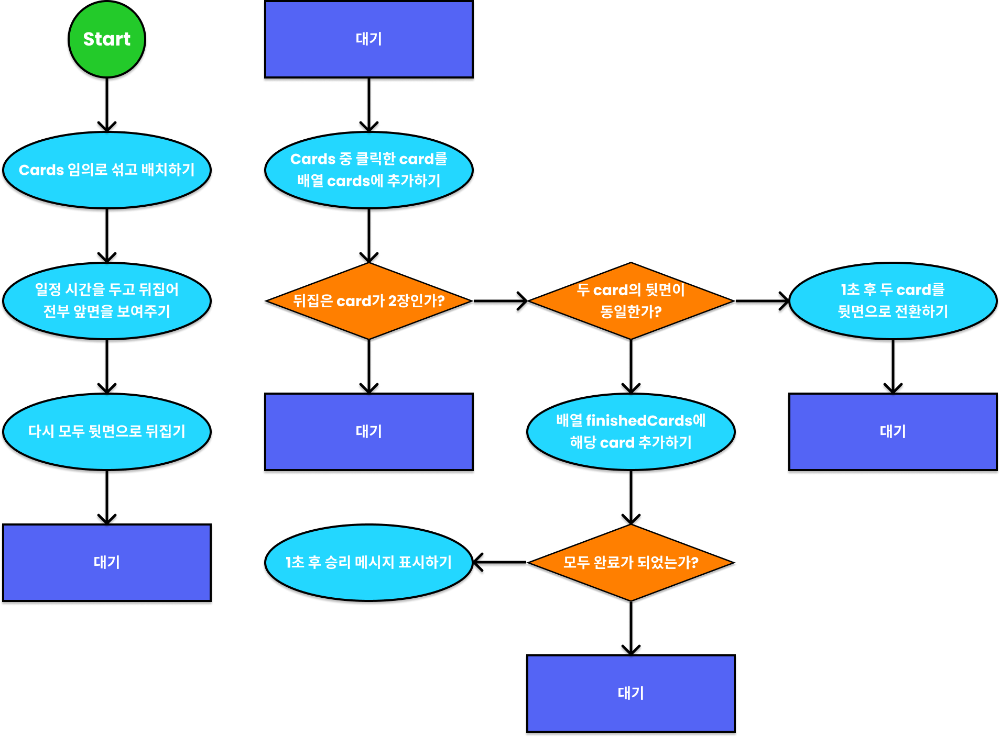

---

### 001. Rules

#### Javascript 필수 문법: 이벤트 루프, 실행 컨텍스트, 프로미스

1. 카드 전체를 보여준다.
2. 카드 전체를 뒷면으로 뒤집는다.
3. 게임 시작 시간을 기록한다.
4. user가 선택한 카드 2장을 차례로 앞면으로 뒤집는다.
5. 카드 2장이 일치하면 유지, 불일치하면 다시 뒷면으로 뒤집는다.
6. 전부 맞춘 경우 게임 진행 시간과 승리 메시지를 보여준다.
7. Top7 기록을 남긴다.

### 002. cards 생성하기

총 20장의 card를 생성하고, 각 card 마다 1 ~ 10 숫자를 작성하고, 해당 숫자의 색을 Yellow, White로 설정한다.

### `concat`

concat method를 활용하면, 얕은 복사를 통해 새로운 배열을 만들어 낼 수 있다.

```js
const arrCopy = arr.concat();
```

또한, `concat`의 인수로 단순 숫자값이나 배열을 넣으면 하나의 배열로 추가된다.

```js
const arr = [1];
arr.concat(2);
arr.concat([3]);

console.log(arr);

< [1, 2, 3]
```

### Fisher-Yates Shuffle

```js
function cardShuffle() {
  for (let i = 0; numbersCopy.length > 0; i++) {
    const randomIndex = Math.floor(Math.random() * numbersCopy.length);
    shuffled = shuffled.concat(numbersCopy.splice(randomIndex, 1));
  }
}
```

### 003. 카드 잠시 보여주고 뒤집기

게임 시작 후, 모든 카드에 `flipped` className을 추가했다가 제거하면 된다.

### querySelectorAll, forEach

이 경우 모든 카드를 선택하기 위해 `document.querySelectorAll('.pairing__card')`를 활용한다. 이는 기존의 `querySelector`와 다르게 배열을 반환한다. 따라서, 모든 카드를 하나하나 공개하기 위해서는 배열의 `forEach` method를 활용할 수 있다.

```js
document.querySelectorAll(".pairing__card").forEach((card, index) => {
  setTimeout(() => {
    card.classList.add("flipped");
  }, 1000 + 100 * index);
});
```

각각 다른 시간에 공개되게끔 ms에 `index`를 활용하여 약간의 차이를 둘 수 있다.

### 004. 카드 클릭해 짝 맞추기

#### event Bubbling

카드에 직접 eventListener를 각각 추가하는 것보다 event Bubbling을 활용하는 것이 더 좋을 수도 있다. 하지만, 이 경우 `pairingcard__wrapper`에 eventListener를 추가하게 되면, 카드와 카드 사이 여백을 클릭해도 event가 발생하기 때문에, 각각 추가하는 방법이 더 낫다.

#### eventListener callback 함수의 `this`

`this`는 원래 `window`를 의미하나, eventListener callback 함수의 `this`는 해당 eventListener가 추가된 태그를 의미한다.

#### querySelector의 연속 사용

querySelector는 연달아 사용해서 자식 태그를 검색할 수 있다.

```js
document.querySelector('head');

document.querySelector('head').querySelector('title');
document.querySelector('head title');

< <head>...</head>
< <title>Web game</title>
< <title>Web game</title>
```

#### `concat` method

```js
correctCards.push(clicked[0]);
correctCards.push(clicked[1]);
clicked = [];
```

이처럼 짝이 맞는 카드를 뒤집은 경우에 새로운 배열에 추가하고, 기존 배열을 초기화하는 작업을 배열의 `concat` method를 활용해, 더 간결하게 작성할 수 있다.

```js
correctCards = correctCards.concat(clicked);
```

#### 참고

성능은 알고리즘 문제와 실제로 사용자들이 사용하는 경우에 중요한데, 다른 것은 고려하지 않아도 되나 반복문을 중복해서 사용하는 경우에는 성능을 반드시 고려해야 한다.

### 005. 새로 시작 btn 만들기

초기화하는 것이 중요한데, 이때 배열의 원본을 수정하게 되는 `method`, `push`, `pop`, `unshift`, `shift`, `splice`, `sort` 등을 사용하면 안 된다.

### 006. bugs

1. victory message 이전에 마지막 card가 뒤집어지지 않는 bug
   victory message 코드에 `setTimeout` 추가해 수정 가능하다.

2. card 확인 시, click이 불가능해야 하는데, click하면 뒤집히는 bug
3. 짝이 맞아 뒤집은 card를 click하는 것이 불가능해야 하는데, click하면 뒤집히는 bug
4. 한 card를 두번 연달아 click시 더 이상 해당 card click 불가능해지거나 게임이 완료된다는 메시지가 열리는 bug

2번에서 4번까지는 click이 되지 않아야 하는 순간에 click이 되는 bug이다. 따라서 click이 가능해야 하는 상황과 불가능해야 하는 상황을 구분해야 하므로, `isClickable` flag 변수를 활용해야 한다.

기본적으로 `false` 값을 가지고, click을 허용해야 하는 경우에만 `true` 값으로 변경해주면 된다.

즉, flag 변수가 `false`이거나, 이미 click 한 후 짝이 맞아 뒤집은 card이거나, 방금 click한 card를 연달아 click하는 것을 방지한다.

```js
if (!isClickable || correctCards.includes(this) || clicked[0] === this) {
  return;
}
```

5. 서로 다른 네 가지 색의 card를 연달아 click하면, 마지막 두 card가 남아 있는 bug

이 bug는 Call Stack과 Event Loop와 관련되어 있다.

### 007. 호출 스택(Call Stack) && Event Loop

click event는 비동기 event이다. 내부에 비동기 함수인 `setTimeout()` 함수가 존재하기 때문에 코드의 실행 순서를 파악하기 어렵다. 이를 명확하게 파악하려면 호출 스택(Call Stack)과 Event Loop에 대해 알고 있어야 한다.

우선 호출 스택(Call Stack)은 동기 코드를 담당하고, Event Loop는 비동기 코드를 담당하고 있고, 추가적으로 비동기 코드 실행에는 background, task queue 개념이 필요하다.

#### 호출 스택(Call Stack)

호출 스택(Call Stack)은 **여러 함수**들이 실행되는 공간을 의미한다. 호출 스택(Call Stack)이 비어있는 경우 task queue에서 함수를 하나씩 호출 스택(Call Stack)으로 옮기고, 호출 스택(Call Stack)으로 이동한 함수는 실행된다. 실행이 완료된 함수는 호출 스택(Call Stack)에서 빠져 나가고, 호출 스택(Call Stack)이 비어있기 때문에 다시 task queue의 다음 함수를 호출 스택(Call Stack)으로 옮긴다.

#### 이벤트 루프(Event Loop)

Event Loop는 호출 스택(Call Stack)이 비어있는 경우 task queue에서 function을 꺼내 실행해주는 역할을 한다. 즉, task queue에 대기하는 Function을 호출 스택(Call Stack)으로 이동시킨다. 호출 스택(Call Stack)이 비어있는 경우 task queue에서 함수를 하나씩 호출 스택(Call Stack)으로 옮기는 역할을 Event Loop가 맡고 있다.

#### 백그라운드(background)

background는 **Timer, EventListener** 등이 존재하는 공간을 의미한다. setTimeout() 함수가 실행되면, background에서 시간을 재고, 시간이 되면 setTimeout() 함수의 callback Function을 task queue로 보낸다. 즉, background에서 코드를 실행하는 것이 아니라, 실행될 callback Function이 task queue로 들어간다.

#### 태스크 큐(task queue)

taks queue는 Timer, EventListener 등의 **callback Function**이 존재하는 공간을 의미한다. 즉, 실행되어야 할 callback Function이 대기하는 공간이다. queue의 특성 상 먼저 들어온 함수부터 실행된다. 다만, task queue도 함수를 직접 실행하지는 않고, 모든 함수는 호출 스택(Call Stack)으로 들어가서 호출/실행된다.

#### 코드 분석하기

변수, 함수의 선언은 호출 스택(Call Stack)과 Event Loop에 영향을 주지 않는다. 따라서, 해당 코드에서 처음으로 함수가 호출되는 순간은 `startGame()`이다.

이때, 함수가 처음으로 실행되는 순간에 브라우저에서는 하나의 함수가 실행되는데, 이를 Google Chrome에서는 `anonymous` 함수로 표시한다.

```js
function a() {
  b();
}
function b() {
  console.trace();
}

a();

< console.trace
  b             @ VM109:5
  a             @ VM109:2
  (anonymous)   @ VM109:8
```

즉, `function anonymous()` 내부에 `function a()`, `function b()`를 선언하기 때문에, 사실상 어떤 javascript 코드를 실행하는 것은 `function anonymous()` 함수를 실행하는 것과 동일하다.

호출 스택(Call Stack)을 확인할 수 있는 method인 `console.trace()`를 통해 함수의 종료 순서를 확인해보면, `function anonymous()`가 가장 먼저 실행되고, 이후에 `function a()`, 마지막으로 `function b()`가 실행된 이후에 종료되고, 다시 `function a()`가 종료된 후 마지막으로 `function anonymous()`가 종료다는 것을 알 수 있다.

함수의 선언과 호출을 제대로 구분해야 하며, 해당 함수가 종료된 것은 함수 선언의 {}가 끝나는 부분에서 함수가 종료된 것임을 알 수 있다.

일반적으로 호출 스택(Call Stack)의 함수가 모두 종료되어 비어있으면 Javascript가 종료된다고 하지만, 백그라운드(Background), 태스크 큐(Task Queue)에 비동기 함수가 존재하는 경우에는 종료되지 않는다.

setTimeout은 한 번만 실행되기 때문에 백그라운드(Background)에 등록되었다가, 해당 Timer의 callback Function이 태스크 큐(Task Queue)로 이동하면, 백그라운드(Background)에서 삭제된다.

이벤트 루프(Event Loop)는 호출 스택(Call Stack)이 비어 있으면, 태스크 큐(Task Queue)에서 하나씩 함수를 끌어 올린다. 따라서, 1초 Timer의 callback Function이 호출 스택(Call Stack)으로 올라가면서, 해당 함수를 실행하고, 종료되면 호출 스택(Call Stack)에서 빠져나간다.

이후 모든 Timer의 callback Function이 동일한 과정을 거쳐 호출 스택에서 빠져나가면, 호출 스택과 태스크 큐 모두 비어있게 된다. 이 상태가 순서도에서 표시한 '대기' 상태가 된다.

#### bug #5 분석하기

백그라운드(background)에서 대기하고 있는 Card Click Event를 서로 다른 4장의 card를 연달아 click한 경우에서 2, 5, 8, 9번 card를 click했다고 가정하자.

click event가 4회 발생했으므로, 백그라운드에서 해당 click event의 callback Function 4개를 태스크 큐로 보낸다.

이후 이벤트 루프는 호출 스택이 비어있으므로, 태스크 큐에서 callback Function을 하나씩 불러 실행한다. 우선 card #2의 click callback Function을 실행하고, card #2는 `clicked` 배열에 추가된 후 함수가 종료되어 호출 스택에서 나간다.

그 다음 card #5를 click한 경우, 해당 callback Function에 따라 `clicked` 배열에 card #5가 추가되어, 해당 배열에 두 개의 card가 존재한다. 이 두 card는 숫자가 다르므로, setTimeout이 실행되고, 0.5초 Timer가 백그라운드에 등록된다.

이 부분에서 bug의 원인을 파악할 수 있다. 즉, 0.5초 Timer의 callback Function이 card #8 callback Function보다 늦게 태스크 큐에 들어오기 때문에 선입 선출의 원칙에 따라 0.5초 Timer의 callback Function이 더 늦게 실행된다.

즉, 동기적인 코드를 먼저 호출하여 `clicked = [2, 5, 8, 9]`가 된 후 비동기 callback Function인 `setTimeout`이 호출되기에 bug가 발생하는 것이다.

따라서, `clicked[0]`, `clicked[1]`의 `className`을 제거해 뒤집을 수 있지만, 이후 `clicked = []`를 통해 초기화하므로, `clicked[3]`, `clicked[4]`에 있는 card #8, card #9를 뒤집을 수가 없다.

결국 이 bug를 해결하기 위해서는 clicked 배열에 2장의 card가 들어간 이후로 flag 변수를 `false`로 변경해 세 번째 card는 click이 불가능하게 만들면 된다.

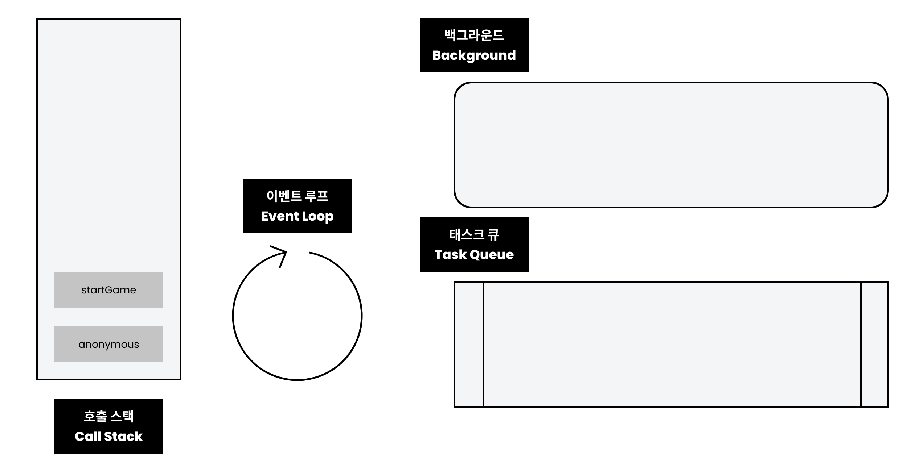
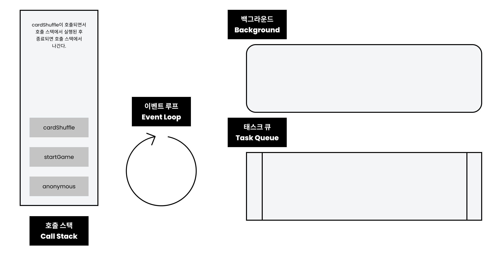
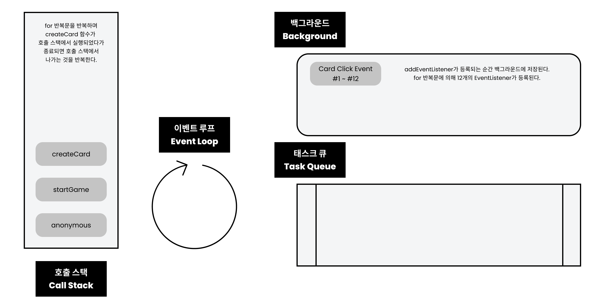

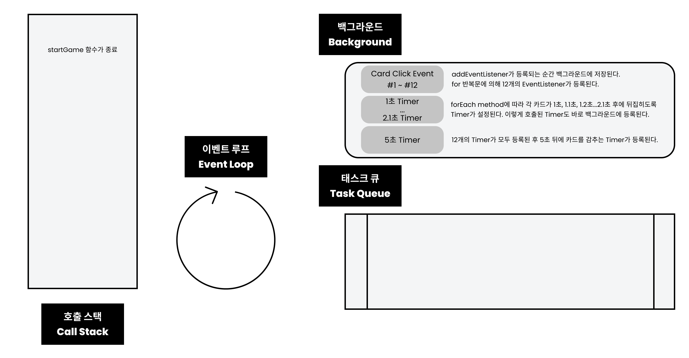

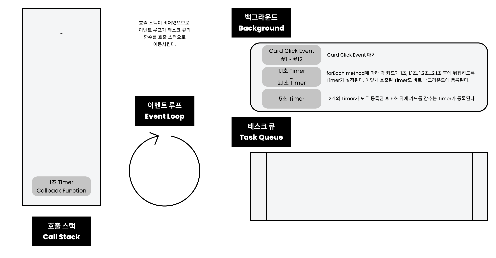
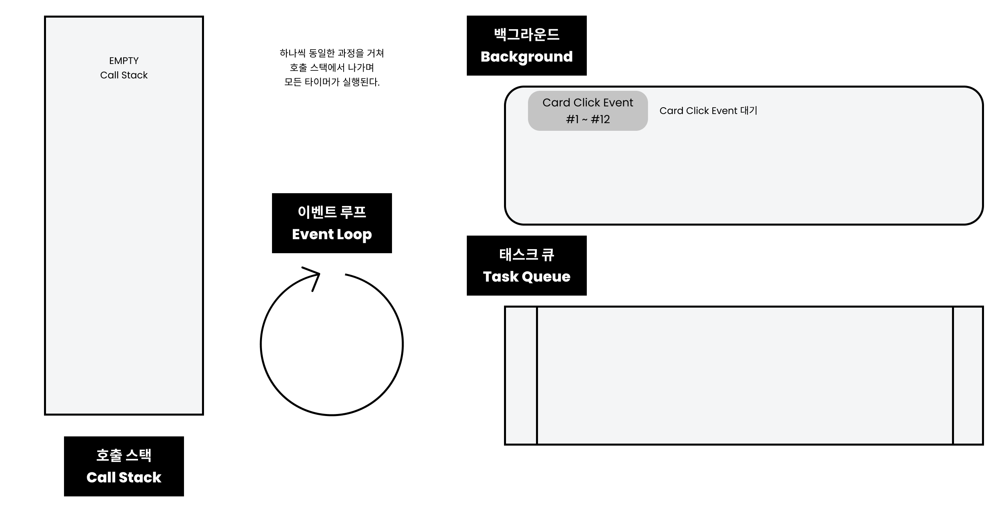
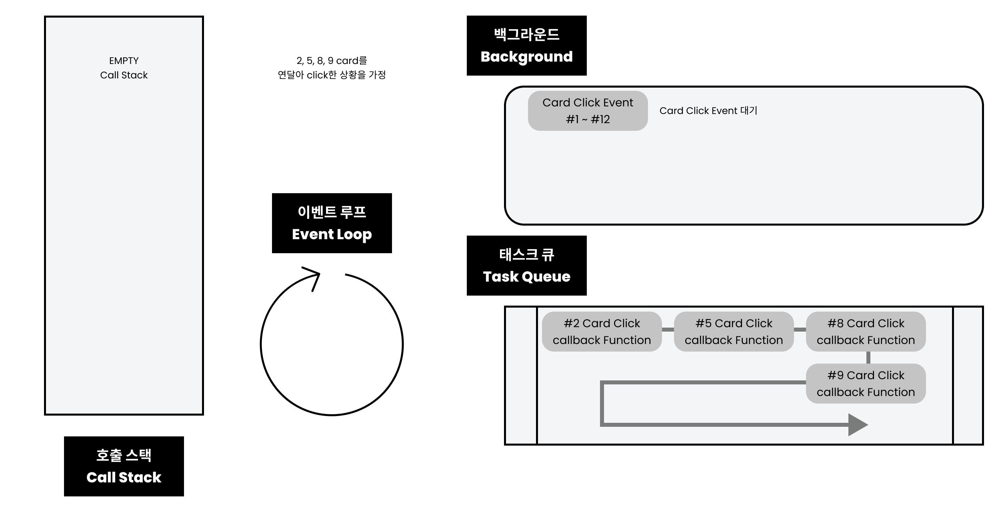
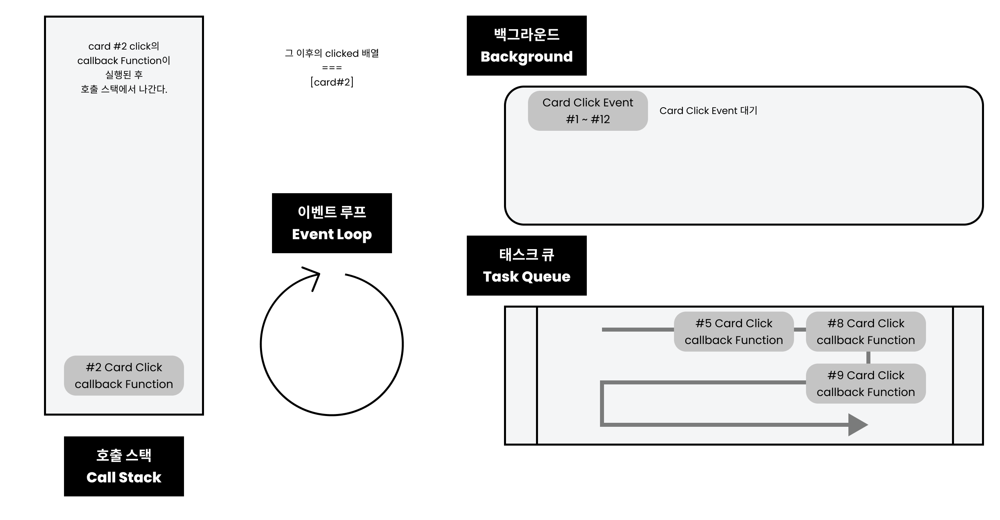
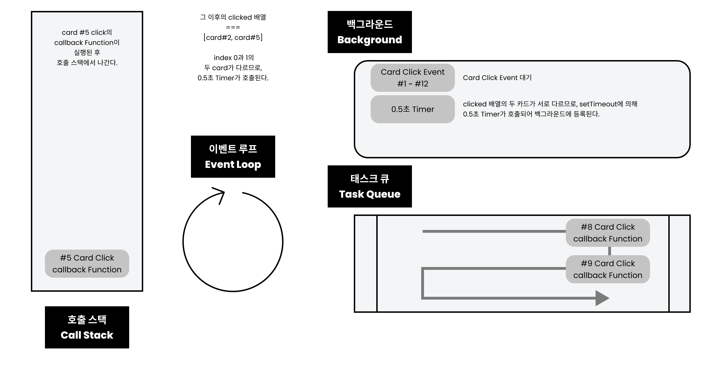
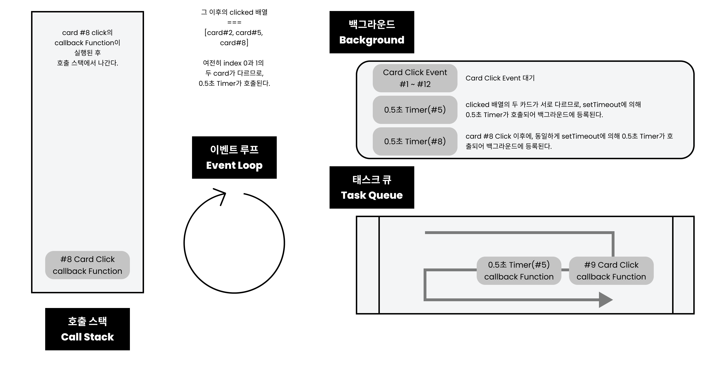
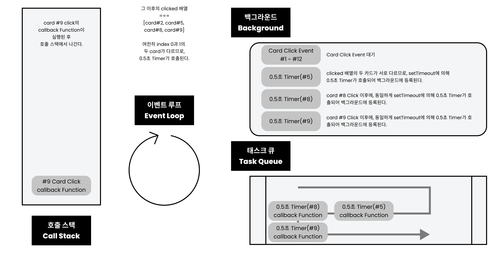


---

#### 참고

- setTimeout이 정확하지 않은 경우
  호출 스택에 이전에 들어있는 함수가 오래 걸리는 함수여서 Timer가 지정된 시간이 지났는데도 불구하고, 해당 Timer의 callback Function이 태스크 큐에서 호출 스택으로 넘어가지 못해 실행이 늦어지는 것.

- 유의사항
  설계할 때는 순서도를 작성하는 것이 중요하고, 코드를 작성할 때는 scope에 유의해야 한다. 이후 코드를 검증할 때 호출 스택, 이벤트 루프를 파악해야 한다.

#### Example Case

```js
function aaa() {
  setTimeout(() => {
    console.log("d");
  }, 0);
  console.log("c");
}

setTimeout(() => {
  console.log("a");
  aaa();
}, 0);

setTimeout(() => {
  aaa();
  console.log("b");
}, 0);

a;
c;
c;
b;
d;
d;
```

#### Call Stack

#1 anonymous -> #2 setTimeout(1) -> #4 ~~setTimeout(1)~~ -> #5 setTimeout(2) -> #7 ~~setTimeout(2)~~ -> #8 ~~anonymous~~
#13 0s Timer(1) -> #16 aaa -> #17 setTimeout(3) -> #18 console.log(c) ->

#### background

#3 0s Timer(1) -> #6 0s Timer(2) -> #10 ~~0s Timer(1)~~ -> #12 ~~0s Timer(2)~~ -> #18 0s Timer(3)

#### Task Queue

#9 0s Timer(1) -> #11 0s Timer(2) -> #14 ~~0s Timer(1)~~ ->

#### Console

#15 a -> c -> c -> b -> d -> d

www.latentflip.com/loupe

### 008. 마무리

1. 호출 스택(Call Stack)
   동기 함수만 있을 때는 호출 스택만 고려하면 된다. 함수가 호출될 때, 호출 스택에 들어가 실행이 되고, 실행이 끝나면 호출 스택에서 빠져나간다. 기존 함수의 실행이 완료되지 않았는데, 다른 함수가 호출되면 새로 호출된 함수는 기존 함수 위에 쌓이게 된다.
   처음 파일을 실행할 때 anonymous라는 익명함수가 실행된다.(Google Chrome)

2. 이벤트 루프(Event Loop)
   비동기 함수가 실행될 때는 호출 스택뿐만 아니라, 이벤트 루프까지 동원해 실행 순서를 파악해야 한다. Timer, EventListener 같은 비동기 함수는 callback Function을 백그라운드에서 태스크 큐로 보낸다. 이벤트 루프는 호출 스택이 비어 있는 경우에 태스크 큐에서 하나씩 함수를 꺼내 호출 스택으로 보내 실행한다. 즉, 호출 스택이 비어 있지 않은 경우면, 태스크 큐에 있는 함수는 실행되지 않는다.

---

---

## Chapter 12. mine-sweeper

### 000. FlowChart

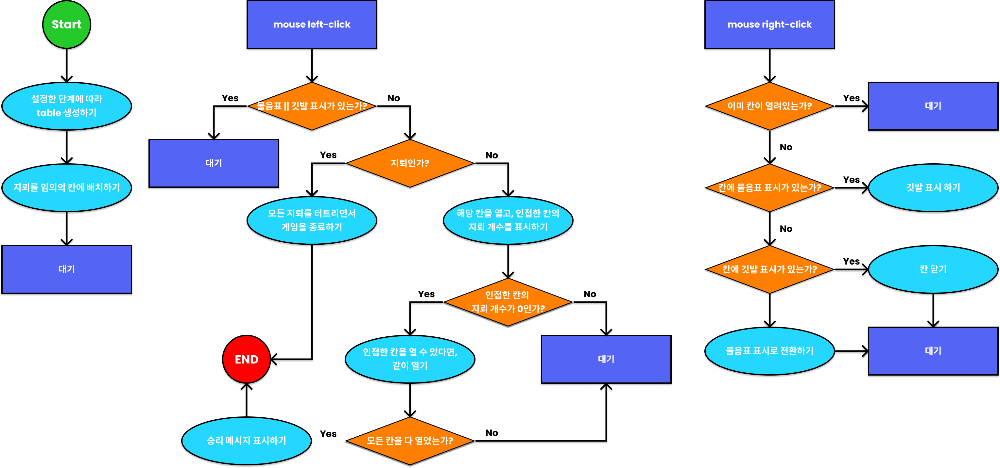

---

### 001. Rules

1. 테이블 모양의 칸을 만들기
2. 지뢰를 무작위로 배치하기
3. 칸 클릭 시 주변 지뢰 개수 표시하기
4. 주변 지뢰 개수가 0이라면 한 번에 모든 칸을 여는 작업 설정하기
5. 마우스 우클릭 시 물음표, 깃발 표시하기

---

### 002. 지뢰 심기

#### 개요

실제로 지뢰가 보이는 칸도 존재하고, 아직 열리지 않은 칸에도 존재하고, 깃발 혹은 물음표 표식을 가진 칸에도 존재할 수 있기 때문에, 단순히 `textContent`로만 지뢰를 나타내기는 부적절하다고 판단된다. 결국, 이러한 경우에는 javascript의 데이터와 화면을 따로 구성해주어야 한다.

또한, 화면이 다양하게 표현되기 때문에 이러한 화면의 종류를 체계적으로 정리하고 분석해야 한다.

mouse right click Event 구현할 때, 구분하기 위해 지뢰가 있는 모양과, 지뢰가 없는 모양을 나누어야 한다.

- 클릭하여 터진 지뢰 칸에 나타나는 지뢰 모양과 빨간 색 배경화면
- 클릭하지 않아 터지지 않은 지뢰 칸에 나타나는 지뢰 모양
- Opened(1 ~ 8) | 열려서 인접 칸의 지뢰 갯수를 표현하는 1 ~ 8까지의 숫자
- Opened(0) | 열렸으나 지뢰가 존재하지 않은 빈 칸의 화면(사실상 0)
- Normal(-1) | 단순히 닫힌 칸의 화면(내부에 지뢰 존재하지 않음)
- Question(-2) | 닫힌 칸에 작성한 물음표 모양의 표식이 부여된 화면(내부에 지뢰 존재하지 않음)
- Flag(-3) | 닫힌 칸에 작성한 깃발 모양의 표식이 부여된 화면(내부에 지뢰 존재하지 않음)
- Question_Mine(-4) | 닫힌 칸에 작성한 물음표 모양의 표식이 부여된 화면(내부에 지뢰 존재)
- Flag_Mine(-5) | 닫힌 칸에 작성한 깃발 모양의 표식이 부여된 화면(내부에 지뢰 존재)
- Mine(-6) | 단순히 닫힌 칸의 화면(내부에 지뢰 존재)

#### 2차원 배열 생성하기

2차원 배열을 만들기 위해서 `for` 반복문을 중첩 활용한다.

```js
let data = [];
for (let i = 0; i < row; i++) {
  const rowData = [];
  data.push(rowData);
  for (let j = 0; j < cell; j++) {
    rowData.push;
  }
}
```

#### 지뢰 개수만큼 무작위로 칸 설정하기

#### 2차원 배열에 지뢰 넣기

지뢰를 삽입할 칸의 숫자를 10a + b라고 할 때, 셀 개수로 나눠 일반화할 수 있다.

```js
for (let k = 0; k < shuffle.length; k++) {
  const verticalMinePosition = Math.floor(shuffle[k] / cell); // a번째 줄(몫)
  const horizontalMinePosition = shuffle[k] % cell; // b번째 칸(나머지)
  data[verticalMinePosition][horizontalMinePosition] = CODE.Mine; // 10a + b가 (a, b)에 삽입됨
}
```

---

### 003. mouse right click 기능 구현하기

mouse right click Event는 `'click'`이 아니라 `'contextmenu'`로 구현할 수 있다. 이때 기본 동작으로 메뉴가 열리는 것을 `event.preventDefault()`([mdn](https://developer.mozilla.org/ko/docs/Web/API/Event/preventDefault)) method를 활용해서 차단해야 한다.

또한, `HTMLTableRowElement.rowIndex`, `HTMLTableCellElement.cellIndex` 속성을 활용해 해당 칸의 데이터가 어떤 데이터인지에 따라 우클릭 Event 발생 시 표시를 변경하게끔 코드를 작성할 수 있다.

각 칸의 상태에 따라, 해당 데이터를 변경하고, 그에 맞추어 화면을 변경해주는 것이 중요하다.

```js
data[rowIndex][cellIndex] = CODE.Question_Mine; // 데이터 변경
target.className = "question"; // CSS 변경
target.textContent = "?"; // 화면 변경
```

다만, 이때 중요한 것은 같은 `'?'` 칸이더라도 내부의 지뢰 여부에 따라 다른 데이터를 가지게 해야 다시 닫힌 칸으로 돌아올 때 문제가 발생하지 않는다는 점이다. 즉, 화면은 같은데 다른 데이터를 가지게 해야 이후에 문제가 발생하지 않는다.

마지막으로 Event Bubbling을 통해 `<tbody>`에만 eventListener를 추가하고, 내부의 각 칸에 해당하는 `<td>`에는 Event Bubbling으로 Event가 전달되도록 할 수 있다.

#### `HTMLTableRowElement.rowIndex`, `HTMLTableCellElement.cellIndex`

이를 활용해 `<td>`의 부모 태그인 `<tr>`을 선택하고, `<tr>` 태그는 `rowIndex` 속성을 제공해, 몇 번째 줄인지 파악할 수 있다. 또한, `<td>` 태그는 `cellIndex` 속성을 통해 몇 번째 칸인지 파악할 수 있게끔 해준다.

```js
const rowIndex = target.parentNode.rowIndex;
const cellIndex = target.cellIndex;
```

#### Event Bubbling

`<td>`에 직접 100개의 eventListener를 추가하면, 이후에 완전히 게임이 종료된 이후에는 각각 100개 모두 제거해주어야 한다.

따라서 `<tbody>`에 하나의 eventListener를 추가하여 Event Bubbling을 활용해 쉽게 코드를 작성할 수 있다.

만약 Event Bubbling을 방지하려면, `event.stopPropagation()`([mdn](https://developer.mozilla.org/ko/docs/Web/API/Event/stopPropagation)) method을 추가하면 Bubbling 현상을 막을 수 있다.

---

### 004. mouse left click 기능 구현하기

#### 주변 셀 선택하기

rowIndex, cellIndex를 활용

#### `Array.prototype.includes()`

`Array.prototype.includes(valueToFind, |fromIndex|)`([mdn](https://developer.mozilla.org/ko/docs/Web/JavaScript/Reference/Global_Objects/Array/includes))

#### && || 기능([javascript.info](https://ko.javascript.info/logical-operators))

&& 존재 하면, 2를 실행
|| 존재하지 않으면, 2를 실행

#### Optional Chaining (?.)([mdn](https://developer.mozilla.org/ko/docs/Web/JavaScript/Reference/Operators/Optional_chaining))

객체나 배열에서 존재하지 않는 경우에 undefined를 반환하는데, 다시 indexing을 하는 경우 Error가 발생하는 것을 방지하기 위해 optional Chaining을 사용한다.

`data[-1]`처럼 index가 음수인 경우 undefined를 반환한다. 따라서, `data[-1][-1]`은 undefined의 -1 index를 찾는 것이기 때문에 Error가 발생한다.

결국, Error를 방지하기 위해서는 if문으로 보호해야 한다.

```js
if (data[-1]) {
  data[-1][-1];
}
```

이를 Optional Chaining을 활용하여 작성하면 다음과 같다.

```js
data[-1]?.[-1];
```

객체의 경우 `.`으로 접근하기 때문에 `?`만 추가하면 된다.

```js
const a = { b: [] };

a.b[0]?.cdef.gh; // undefined
```

Nullish coalescing operator([mdn](https://developer.mozilla.org/ko/docs/Web/JavaScript/Reference/Operators/Nullish_coalescing_operator))

#### 경계선 Click 시 발생하는 bug

보통 개발자 모드에서만 볼 수 있는 bug이다.
칸이 아닌 곳을 click하는 경우에, return하는 if문을 활용해 해결할 수 있다.

#### 재귀 함수(recursive function)
해당 칸을 열었을 때, 해당 칸의 값이 0인 경우에 인접한 칸을 열기 위해서는 `openAround()` 함수를 구현해야 한다.

```js
function openAround(rowIndex, cellIndex) {
  const count = open(rowIndex, cellIndex);
  if (count === 0) {
    open(rowIndex - 1, cellIndex - 1);
    open(rowIndex - 1, cellIndex);
    open(rowIndex - 1, cellIndex + 1);
    open(rowIndex, cellIndex - 1);
    open(rowIndex, cellIndex + 1);
    open(rowIndex + 1, cellIndex - 1);
    open(rowIndex + 1, cellIndex);
    open(rowIndex + 1, cellIndex + 1);
  }
}
```
다만, 이 경우 빈 칸을 click해 열었을 때, 근처 빈 칸을 함께 열어주는 기능을 구현하기 위해서는 자기 자신을 호출하는 함수를 재귀 함수(recursive function)를 활용해야 한다.

```js
function openAround(rowIndex, cellIndex) {
  const count = open(rowIndex, cellIndex);
  if (count === 0) {
    openAround(rowIndex - 1, cellIndex - 1);
    openAround(rowIndex - 1, cellIndex);
    openAround(rowIndex - 1, cellIndex + 1);
    openAround(rowIndex, cellIndex - 1);
    openAround(rowIndex, cellIndex + 1);
    openAround(rowIndex + 1, cellIndex - 1);
    openAround(rowIndex + 1, cellIndex);
    openAround(rowIndex + 1, cellIndex + 1);
  }
}
```
따라서, 빈 칸을 열었을 때, 인접 칸도 0이면 열리게 된다. 다만, 이때 `Maximum call stack size exceeded` Error가 발생한다. 이는 제한된 호출 스택(Call Stack)의 최대 크기를 초과하는 경우 발생하는데, 보통 재귀 함수에서 자주 발생한다.

따라서 호출 스택의 크기를 확인해보면, 다음과 같은 재귀 함수 코드로 확인할 수 있다.

```js
let i = 0;
function recurse() {
  i++;
  recurse();
}

try {
  recurse();
} catch (ex) {
  alert('최대 크기는 ' + i + '\n  error: ' + ex);
}
```
대략 Google Chrome 브라우저에서는 13948의 크기의 호출 스택을 활용하고 있음을 알 수 있다.

이를 해결하기 위한 가장 간단한 방법은 '비동기 함수'를 활용하는 것이다. 즉, 재귀 함수인 `openAround()` 내부에서 가장 대표적인 '비동기 함수'인 `setTimeout()`의 시간을 `0ms`로 하여 즉시 실행될 수 있도록 활용하는 것이다.

```js
function openAround(rowIndex, cellIndex) {
  setTimeout(() => {
    const count = open(rowIndex, cellIndex);
    if (count === 0) {
      openAround(rowIndex - 1, cellIndex - 1);
      openAround(rowIndex - 1, cellIndex);
      openAround(rowIndex - 1, cellIndex + 1);
      openAround(rowIndex, cellIndex - 1);
      openAround(rowIndex, cellIndex + 1);
      openAround(rowIndex + 1, cellIndex - 1);
      openAround(rowIndex + 1, cellIndex);
      openAround(rowIndex + 1, cellIndex + 1);
    }
  }, 0);
}
```
이렇게 구현한 재귀 함수는 호출 스택에 `openAround()` 함수가 두 개 이상 쌓이지 않아 최대 크기를 초과하는 Error가 발생하지 않는다.

다만, 열어야 할 칸이 많으면 브라우저가 느려지고, 멈추게 된다. 한 칸을 열 때마다 주변 8칸을 검사한 뒤 열고, 주변 8칸이 다시 주변 8칸을 검사한 뒤 열고 있기에 연산량이 많아졌기 때문이다.

즉, 어떤 하나의 칸을 열고 인접 칸을 열면, 그 인접 칸의 인접 칸을 열게 될 때 처음 열었던 해당 칸이 인접 칸이 되어 열게 된다. 따라서 무한 반복에 빠지게 된다.

따라서 한 번 열었던 칸은 검사와 인접 칸 열기에서 제외해야 한다.
```js
function open(rowIndex, cellIndex) {
  if (data[rowIndex]?.[cellIndex] >= CODE.Opened) return;
  ...
}
```
다만, `Uncaught TypeError: Cannot read property '1' of undefined` Error가 난 위치 앞의 데이터가 `undefined`인 경우에 발생하는 Error이므로, Optional Chaining으로 보호해주어야 한다.

---
### 005. 승리 message && 게임 시간 보여주기

`openCount` 변수로 열린 칸의 개수를 세어 `row * cell - mine`개, 즉 총 칸 개수에서 지뢰를 제외한 모든 칸을 열면 게임을 승리할 수 있도록 한다. 승리의 경우, 게임 시간 타이머를 멈추고, EventListener를 제거해야 하고, 승리 message를 띄워 주어야 한다.

```js
if (openCount === row * cell - mine) {
  // 게임 소요 시간 기록하기
  const time = (new Date() - mineSweeperStartTime) / 1000;

  // 게임 시간 타이머 멈추기
  clearInterval(interval);

  // EventListener 제거하기
  $mineSweeperTbody.removeEventListener('contextmenu', onRightClick);
  $mineSweeperTbody.removeEventListener('click', onLeftClick);

  // 승리 message 띄우기
  setTimeout(() => {
    alert(`승리! ${time}초가 걸렸습니다.`);
  }, 0);
}
```

이때, 화면이 바뀔 수 있는 시간을 주어야 하기 때문에, `setTimeout()` 함수를 활용해 승리 message를 `alert()` 대화 상자로 표시한다.

---
### 006. row, cell, mine 개수 입력 받기
`<form>`의 `<input>`을 활용해 사용자가 원하는 개수를 입력받고, `<button>`으로 시작하게끔 만들 수 있다.

`<form>`이기 때문에 기본 동작을 막아주어야 하고, 각 value 값을 number 형태로 형 변환해야 한다.

또한, 새로운 게임을 시작할 때 기존 게임을 삭제하여야 하므로, `innerHTML`으로 내부 HTML 코드를 삭제해야 한다.

```js
$mineSweeperForm.addEventListener('submit', onSubmit);

function onSubmit(event) {
  event.preventDefault();
  row = parseInt(event.target.minesweeper__row.value);
  cell = parseInt(event.target.minesweeper__cell.value);
  mine = parseInt(event.target.minesweeper__mine.value);
  openCount = 0;
  $mineSweeperTbody.innerHTML = '';
  drawTable();
  mineSweeperStartTime = new Date();
  interval = setInterval(() => {
    const time = Math.floor((new Date() - mineSweeperStartTime) / 1000);
    $mineSweeperTimer.textContent = `${time}초`;
  }, 1000);
}
```
---

### 007. 첫 번째 click 시에는 지뢰가 나오지 않게 하기
첫 번째 click 시 지뢰가 선택되지 않게 하기 위해서 첫 click 이후에 plantMine() 함수를 실행하여 지뢰를 만드는 방법을 사용할 수 있다. 혹은 첫 번째 click한 칸이 지뢰인 경우 지뢰를 옆으로 옮기는 방법을 활용할 수 있다.

다만, 지뢰를 옆으로 옮기려고 할 때, 인접 칸이 모두 지뢰인 경우에는 또다시 인접 칸으로 지뢰를 옮겨야 하기 때문에, 재귀 함수를 활용해야 한다는 점을 알 수 있다.

이때 onLeftClick()에서 `firstClick`이 true 인 경우에만 transferMine() 함수를 실행한다.

찾은 칸을 재귀함수에 의해 다시 찾게되기 때문에 무한 반복을 방지하기 위해 searched 배열을 만들고, 이는 openAround() 함수와 다르게, 명확한 기준이 없기 때문에 2차원 배열로 생성하여 이미 찾은 칸에서는 빈 칸 찾기를 종료해야 한다.

---
### 008. _Notes_

1. 순서도의 절차에 맞는 함수를 우선 빈 함수로 구현하고 함수의 내용을 채워나가는 식으로 코드를 작성하는 것이 좋다.

2. `<tr>`, `<td>`의 개수가 고정되어 있는 경우에는 HTML 화면에서 미리 구현하는 것이 좋으나, 사용자의 선택에 따라서 개수를 다르게 구현할 것이므로, javascript에서 `document.createElement()`를 활용하는 것이 더 좋다.

3. 항상 Data를 먼저 작성하고, 화면을 이에 맞게 변경해주는 것이 더 좋다.

4. 개발자 모드를 구현하기 위해서 `dev` flag 변수를 활용한다.

5. 정리할 것: contextmenu Event, OC, 재귀 함수, nullish colearishing

6. 추가 기능 구현: Left + Right click 동시 -> 100% 확실한 것 모두 열기, Left Double click -> 기능 등등

---
---

## Chapter 13. 2048

### 000. FlowChart

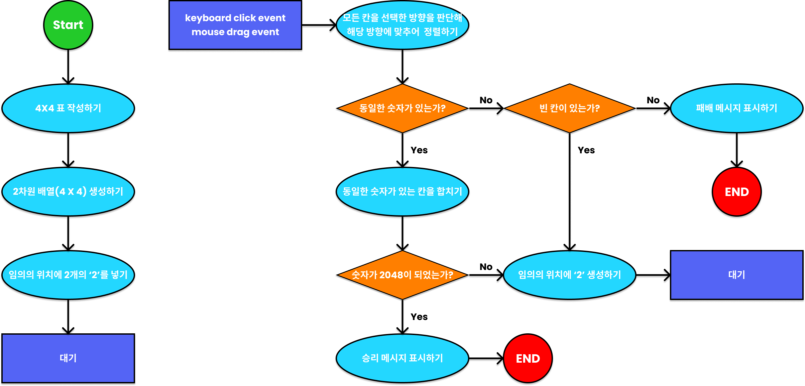

---

### 001. Rules

1. 4 X 4 표를 만든다.
2. 매 순서마다 임의의 위치에 숫자 2가 생성된다.
3. 매 순서마다 user가 한 번씩 마우스 드래그 또는 키보드 화살표 클릭을 하여 방향을 지정한다.
4. 해당 방향으로 숫자들이 기울어진다.
5. 같은 숫자가 인접해 있는 경우에 하나로 합쳐지면서 X2 가 된다.
6. 2 ~ 6을 반복해 2048을 만들면 승리한다.
7. 가장 빠르게 2048을 완성한 사람 or 가장 높은 점수를 가지고 2048을 완성한 사람이 최종 승리자가 된다.(게임 정책에 따라 달라짐)

---

### 002. user가 선택한 방향 판단하기
